<!--
This work is licensed under a [Creative Commons Attribution-NonCommercial-NoDerivs 4.0 International License][cc-by-nc-nd].
[![CC BY-NC-ND 4.0][cc-by-nc-nd-image]][cc-by-nc-nd]
-->

# iPAS資安工程師中級 | 防護實務衝刺班 | 證照筆記 | Ver.20250322 [](https://hits.sh/github.com/heymrsalt/ipas-specialist-notes/)
> 此 repository 為 iPAS 資安工程師 中級證照筆記。\
> 範圍將著重在【防護實務】並以【歷屆難題與解析】與【資安重要專有名詞】方式呈現。

## Authors
> 國立臺北科技大學 資安碩 [HeyMrSalt](https://github.com/HeyMrSalt) 🧂\
> 國立臺北科技大學 資安碩 [WIFI](https://github.com/WIFI0000)\
> 國立臺北科技大學 資安碩 [Adb2](https://github.com/xAdb2)\
> 國立臺北科技大學 資安碩 [Paul](https://github.com/paulwang19)\
> 國立臺北科技大學 資安碩 [Jason](https://github.com/han20011222)

## 學術倫理聲明
> 本筆記僅限於學術研究與學習之用途，嚴禁商業利用、出版或未經授權之修改。\
> 部分內容參考各方資源，整理過程中無意侵犯著作權，已盡量附上原始來源，如有不妥還請指教包涵。\
> 因筆記為人工整理，圖表與內容難免不盡完善，還望多多海涵。\
> 也歡迎有志貢獻者提交 PR 更新筆記讓它更完整，或透過 Issue 分享疑問、建議與討論。\
> 若您意願轉載分享此筆記時，還請務必附上連結，共推知識傳遞與交流！感謝支持！🙏

## 前言
> 往年的 中級資安工程師證照考試【防護實務】通過率約 **三成**，\
> 故此筆記將以【防護實務衝刺班】為設計核心，為此通過率提高得分之目的。\
> 本筆記方向將採用  [【個人評估防護實務歷屆難題】](#歷屆難題與解析) 與 [【個人評估資安重要專有名詞】](#資安重要專有名詞) 。

## 致敬
> 在本筆記的最底下[【Refer】](#Refer)致敬了在過去考試提供資源的網上各 **大大** **前輩** **貢獻者** 們，\
> 他們的 iPAS 資安中級筆記都非常 詳細 厲害，是我撰寫本筆記的動力與起因。\
> 希望本篇能對正在學習資安的你有重點整理之幫助
> **最後祝大家順利通關取得證照 !!!**

## 每週更新ing
> 目前和幾位實驗室同學 規劃了每週一次為期五週的小型讀書會 雖說當前讀書會不對外開放，\
> 但預計會將些讀書會內容/筆記整理上來 以利大家準備 2025/03/22 (六) 中級考試。\
> 同時也更新[【用資安新聞學資安名詞】](#用資安新聞學資安名詞)新章節 關注近期國內外大小資安事件 並 從中認識些資安名詞。\
> 最後預祝各位考生本次順利上岸 💪

---
</br>

```diff
- - - - - - - - - - - - - - - - - - - - 筆記正文開始 - - - - - - - - - - - - - - - - - - - -
```

</br>

# 目錄
- [【官方資訊】](#官方資訊)
- [【歷屆難題與解析】](#歷屆難題與解析)
  - [【113-2 中級 防護實務】](#113-2-中級-防護實務)
  - [【113-1 中級 防護實務】](#113-1-中級-防護實務)
  - [【112-2 中級 防護實務】](#112-2-中級-防護實務)
  - [【112-1 中級 防護實務】](#112-1-中級-防護實務)
  - [【111 中級 防護實務】](#111-中級-防護實務)
- [【資安重要專有名詞】](#資安重要專有名詞)
  - [【資通安全事件通報流程】](#資通安全事件通報流程)
  - [【常見Port號】](#常見Port號)
  - [【白箱黑箱】](#白箱黑箱)
  - [【XaaS】](#XaaS)
  - [【SIEM vs IDS】](#SIEM-vs-IDS)
  - [【APT 名詞說明 以及 常用技術手法】](#APT-名詞說明-以及-常用技術手法)
  - [【Cyber Kill Chain】](#Cyber-Kill-Chain)
  - [【OWASP Top 10 的詳細解釋】](#OWASP-Top-10-的詳細解釋)
  - [【DDoS攻擊種類之對應OSI層級】](#DDoS攻擊種類之對應OSI層級)
  - [【CVSS】](#CVSS)
  - [【SSDLC vs DevSecOps】](#SSDLC-vs-DevSecOps)
  - [【SQL injection 類型】](#SQL-injection-類型)
  - [【待更新-中間人攻擊MITM】](#中間人攻擊MITM)
  - [【魚叉式網釣】](#魚叉式網釣)
  - [【0-day零時差漏洞】](#0-day零時差漏洞)
  - [【Other-days】](#Other-days)
  - [【待更新-Credentials vs Certificates】](#Credentials-vs-Certificates)
- [【用資安新聞學資安名詞】](#用資安新聞學資安名詞)
- [【Refer】](#Refer)

---
</br>

# 官方資訊

- [【鑑定制度與評鑑內容】](#鑑定制度與評鑑內容)
- [【證書效期與換發】](#證書效期與換發)
- [【數發部-資通安全專業證照清單】](#數發部-資通安全專業證照清單)
- [【線上免費資源-工業技術研究院iPAS影音課程】](#線上免費資源-工業技術研究院iPAS影音課程)

---
</br>

## 鑑定制度與評鑑內容

### 鑑定制度架構
> 懶人包 : 兩個都要70分才有證照，若一科過一科沒過，下次可只考沒過的那科 (限三年內)\
> 沒考過初級 可以直接挑戰考中級

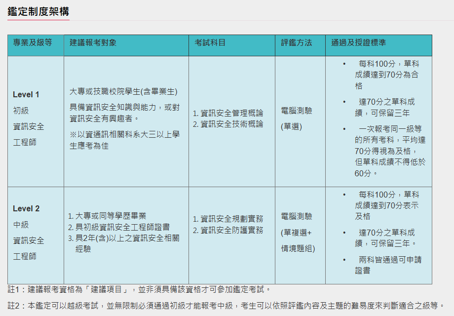 <br>
▲ Fig.Appraisal_System_Structure

### 評鑑內容
> 懶人包 : 
> - 弱點、威脅分類與攻擊手法(20%) 
> - 防護與應變實務(30%) 
> - 安全維運(20%)
> - 滲透測試、源碼測試、資安健診(30%)

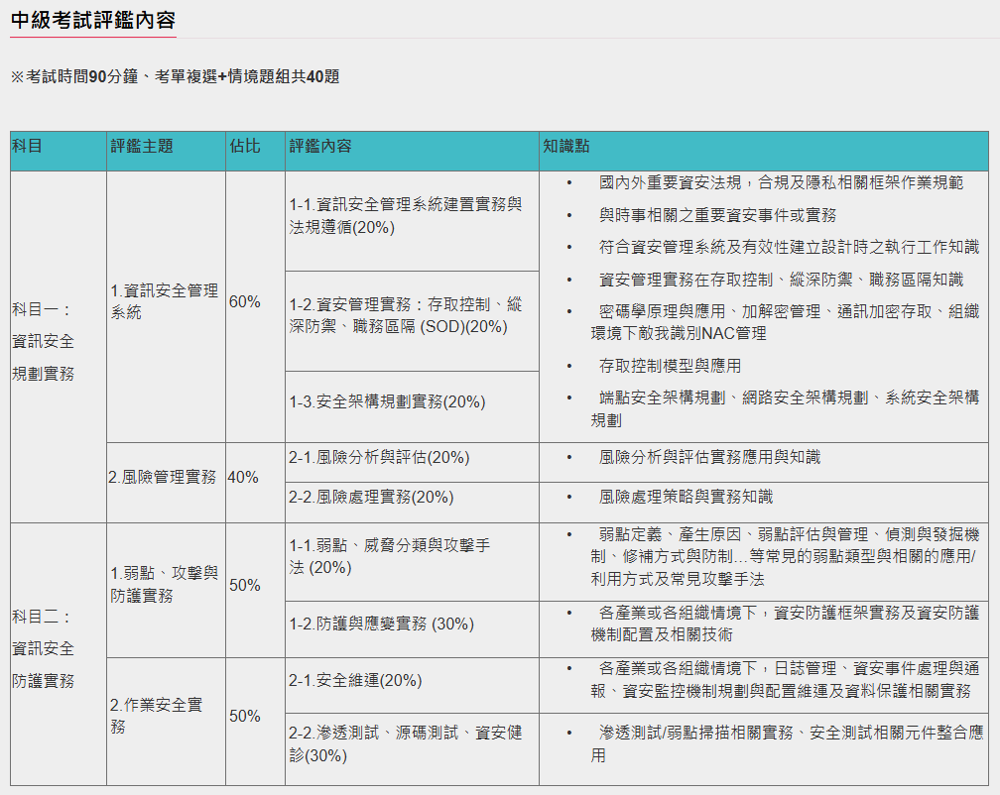 <br>
▲ Fig.Specialist_Examination_Evaluation

Refer : [iPAS經濟部產業人才能力鑑定-資訊安全工程師-鑑定制度與評鑑內容](https://www.ipas.org.tw/ise/AbilityPageContent.aspx?mnuno=675cfae7-387b-4a6d-a4b8-f15a78bb10d4&pgeno=092c80f2-3f12-495b-b8d5-75feb46bd3c8)

</br>

## 證書效期與換發

### 證書效期

初級證書：永久有效，不需換發<br>
中級證書：有效期限為5年，需於證書有效期限屆滿3個月前申請換發

### 證書換發
> 2擇1

(1) 每5年內須接受資訊安全相關訓練，合計時數48小時以上<br>
(2) 從事資訊安全相關工作，取得證書後每一年工作年資得抵訓練時數8小時

Refer : [iPAS經濟部產業人才能力鑑定-資訊安全工程師-證書效期及證書換發](https://www.ipas.org.tw/ise/AbilityPageContent.aspx?mnuno=25150af2-dbc4-45e3-876e-a7214304168a&pgeno=007ad965-30c4-427a-a261-369b0c53d9dc)

</br>

## 數發部-資通安全專業證照清單
> 資通安全專業證照清單（1140124修正）

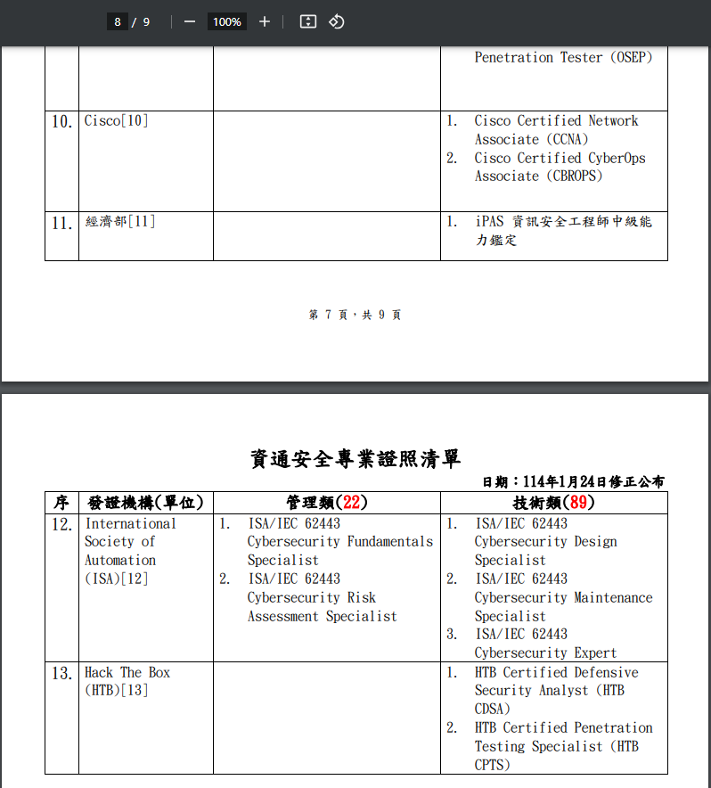 <br>
▲ Fig.Certificate_Certification_List_1140124

Refer : [數位發展部資通安全署-資安專業證照清單](https://moda.gov.tw/ACS/laws/certificates/676)

</br>

## 線上免費資源-工業技術研究院iPAS影音課程
> 工研院有提供免費的iPAS影音課程 可以註冊並加入會員後觀看課程及測驗\
> 非常推薦大家去看去使用 註冊連結幫大家準備在下方 Refer 了\
> ( 不過 不知道為什麼沒有【滲透測試、源碼測試、資安健診】的單元就是了

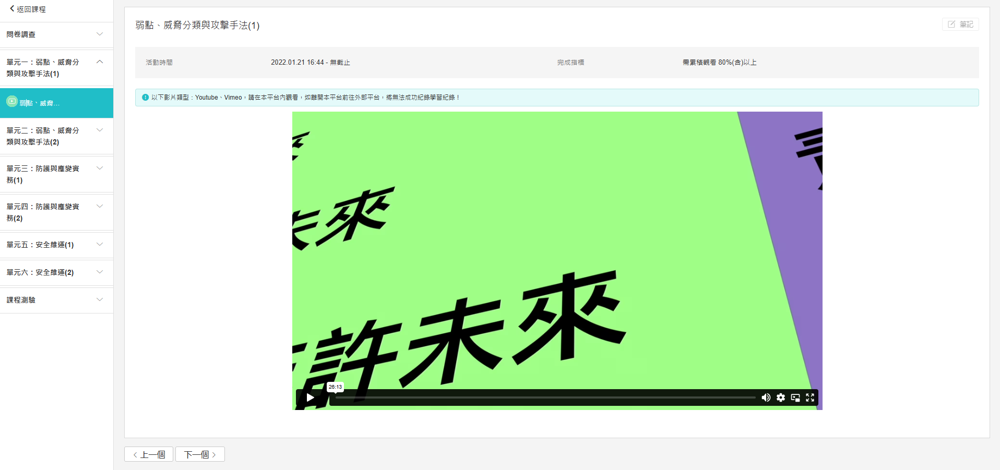 <br>
▲ Fig.ITRI_Courses_and_Tests

Refer : [iPAS數位課程平台入口網址](https://collegeplus.itri.org.tw)

---
</br>

# 歷屆難題與解析

- [【113-2 中級 防護實務】](#113-2-中級-防護實務)
- [【113-1 中級 防護實務】](#113-1-中級-防護實務)
- [【112-2 中級 防護實務】](#112-2-中級-防護實務)
- [【112-1 中級 防護實務】](#112-1-中級-防護實務)
- [【111 中級 防護實務】](#111-中級-防護實務)

---
</br>

## 113-2 中級 防護實務

- [【Q5】](#113-2-Q5)
- [【Q6】](#113-2-Q6)

【題組1】情境如下
```
公司因供應鏈之客戶要求在執行受託業務時，必須針對所承接之受託業務有關的資訊安全有所作為，
因此公司高層下令有關人員針對公司在執行受託業務上可能面臨的資訊安全風險議題進行研議。
```

### 113-2-Q5
【題組1】依據公司高層的要求，工程師正評 估採用「弱點評估」工具來評估公司內部潛在的弱點項目，試問 下列有關「弱點評估」之敘述，下列何者「有誤」？\
(A) 可使用 Nessus Professional 工具來進行系統弱點評估\
(B) 可使用 Acunetix 工具來進行網站弱點評估\
(C) 可使用 Fortify SCA 動態原始碼檢測分析工具來進行軟體 系統之原始碼弱點評估\
(D) 可使用 Nmap 工具來進行網路設備弱點評估\
\
Ans : (C)\
\
原因如下：

(C) Fortify SCA（Static Code Analyzer）是一款 **靜態** 原始碼分析工具，旨在不執行程式的情況下，透過檢查源碼來找出潛在的安全漏洞。\
這種分析方式稱為「靜態應用安全測試」（SAST），適用於軟體開發的早期階段。\
題目中錯誤地將它描述為「動態」原始碼檢測分析工具，這是錯誤的。\
動態分析工具（DAST）通常會在執行程式時進行測試，而這不是 Fortify SCA 的功能​。

Refer : https://www.microfocus.com/documentation/fortify-static-code-analyzer-and-tools/2310/

其他選項解析：

(A) Nessus Professional 是一個廣泛用於系統弱點評估的工具，能夠幫助發現系統層級的安全漏洞​。\
(B) Acunetix 是專門針對網站和網頁應用程式的弱點掃描工具，能夠檢測網站常見的安全漏洞。\
(D) Nmap 雖然主要用於網絡設備的掃描和端口發現，但它可以協助發現網絡設備的潛在弱點，適用於網絡設備的弱點評估​。

Refer : https://www.datamation.com/security/nessus-vs-nmap

因此，(C) 只是因為錯誤描述 Fortify SCA 的用途，將其誤認為是「動態」分析工具，這是與實際不符的。
```diff
- 要知道的是 萬一題目 (C) 改成「靜態」分析工具，則這題將沒有正解。
```

---
</br>

### 113-2-Q6
【題組1】【複選】工程師在評估使用「弱點評估」工具過程中發現了「通用弱點評分系統(Common Vulnerability Scoring System，CVSS)」的網站，請問下列敘述何項錯誤？\
(A) CVSS 是一個開放的框架，主要用於傳達軟體弱點的特徵以及該弱點的風險程度\
(B) CVSS 提供了一種獲取弱點主要特徵並產生回應其嚴重性的數位分數的方法\
(C) CVSS 可以將數位分數轉換為定性表示形式(例如低、中、高以及嚴重)，來提供組織正確評估其弱點管理流程 並確定其處裡弱點的優先順序\
(D) CVSS 由基本度量組(Base metric groups)、時間度量組 (Temporal metric groups)以及環境度量組 (Environmental metric groups)等三個部分所組成\
\
Ans : (A)(D)\
\
原因如下：\
(A) 錯誤的地方在於 CVSS 的主要目的是評估和傳達弱點的嚴重性（Severity），而非風險程度（Risk Level）\
嚴重性評估的是弱點本身的內在特性，如攻擊複雜度、影響範圍等；風險程度則需要考慮更多因素，包括威脅可能性、資產價值和控制措施等\
\
(D) 在 CVSS v2 與 v3 系列（例如 v3.0、v3.1）的確是由三大度量組合成：\
Base（基本度量），Temporal（時間度量），Environmental（環境度量）\
但在 CVSS v4.0（2023年正式釋出）的背景下是不正確的\
因為 4.0把「Temporal（時間度量）」改為「Threat（威脅度量）」，且另外新增「Supplemental（補充度量）」，總共四大度量組\
因此單純說「CVSS 由基本、時間、環境度量組成」已不適用 v4.0。

其他選項解析：

(B) 與 (C) 為正確敘述

(B)「CVSS 產生反映嚴重性的數值分數」無論 v2、v3.1 或 v4.0，都會計算 0–10 之間的最終分數，以量化「漏洞的嚴重程度」\
(C)「CVSS 的數值分數對應到定性等級」，舉例來說對應如下：
- 0.0 = None
- 0.1–3.9 = Low
- 4.0–6.9 = Medium
- 7.0–8.9 = High
- 9.0–10.0 = Critical（或危急）
這種分數對應等級的做法在 CVSS 中相當普遍，也有助於實際漏洞管理中排修優先次序

Refer : https://www.first.org/cvss/v4-0

因此選 (A)(D) 

本筆記這處也有提到相關資訊 點擊查看更多學習資訊 [【CVSS】](#CVSS)

---
</br>

## 113-1 中級 防護實務

- [【Q1】](#113-1-Q1)
- [【Q5】](#113-1-Q5)
- [【Q14】](#113-1-Q14)

### 113-1-Q1
關於 MITRE ATT&CK 中的憑證存取（Credential Access）戰術（Tactic），下列何項錯誤？\
(A) 中間人攻擊（Adversary-in-the-Middle）屬於此類戰術\
(B) 暴力破解攻擊（Brute Force）屬於此類戰術\
(C) 密碼政策探索（Password Policy Discovery）屬於此類戰術\
(D) 變造網站憑證（Forge Web Credentials）屬於此類戰術\
\
Ans : (C)\
\
在 MITRE ATT&CK 框架中，憑證存取（Credential Access）戰術涉及攻擊者使用多種方法來偷取資料和證書，通常用於身份驗證和授權。\
\
(A) 中間人攻擊（Adversary-in-the-Middle）屬此戰術\
這是正確的，因為攻擊者在此類攻擊中可能會**攔截**和**竊取**認證。\
(B) 暴力破解攻擊（Brute Force）屬類戰術\
這也正確，因為暴力破解是一種常見的方法，用來嘗試許多密碼以獲取訪問權限。\
(C) 密碼政策探索（Password Policy Discovery）屬此戰術\
這是錯的，密碼政策探索偏向於獲取有關系統密碼政策信息，而非直接存取憑證。\
(D) 變造網站憑證（Forge Web Credentials）屬此戰術\
這是正確的，製造假的網站憑證是一種直接涉及憑證存取的攻擊方法。\
因此選項 **(C)** 是錯誤的。\
\
Refer :　https://www.netscout.com/what-is-mitre-attack/credential-access

```diff
! 補充：中間人攻擊 縮寫也稱 MITM/MiTM 或 AITM/AiTM
```

[待更新] 本筆記這處也有提到相關資訊 點擊查看更多學習資訊 [【中間人攻擊MITM】](#中間人攻擊MITM)

---
</br>

【題組1】情境如下
```
在 TechSecure Inc.，一家前沿的科技安全公司，資安團隊面臨著一項前所未有的挑戰。
隨著開發團隊需要更多的彈性和功能來進行軟體開發，公司決定在其開發環境中採用 Windows Subsystem for Linux 2 (WSL2)。
這個決策立即吸引了公司內的資安政策制定者 Alex 的注意。
身為公司資安政策訂定者，在面對該公司研發團隊必須使用 Windows Subsystem for Linux 2(WSL2)，必須對其資安攻防的應變性及那些安全管理措施。
```
```
與此同時，一群駭客正在密切關注 TechSecure 的這一舉措。
他們計劃利用 WSL 一個未被廣泛知的漏洞作為橋樑來部署惡意軟體，從而進行內部網絡入侵。
這個團隊本專門設計來利用 WSL2 環境中的漏洞，目標是獲取公司的敏感數據和內部系統的控制權。
駭客計劃藉著利用 Windows Subsystem for Linux (WSL) 來進行網絡入侵。
```

### 113-1-Q5
【題組1】駭客首先在 WSL 環境中部署了一個專門編寫的惡意 script\
該 script 旨在利用 Windows 與 WSL 之間的互操作性漏洞。\
請問其目的，最有可能是下列何項？（請選一個最合適的答案）\
(A) 在 Windows 創立一個隱藏的管理員帳戶，以便未來存取\
(B) 為了直接加密 Windows 系統文件，進行勒索軟體攻擊\
(C) 通過 WSL 環境檢索並傳送 Windows 系統日誌，以分析可能的弱點\
(D) 利用 WSL 執行環境的特性，隱藏網路流量，以掩蓋資料外洩行為\
\
Ans : (D)\
\
就已知的攻擊手法來看，若駭客想要善用 WSL 和 Windows 之間「互操作性」的漏洞，最主要的目的通常是「隱蔽性」\
能夠在不易被偵測或不易受到傳統 Windows 防護機制影響的情況下執行惡意活動。從選項來判斷，\
最符合「利用 WSL 來進行更隱蔽攻擊或外洩」的目的會是 (D) 是一個比較可能的答案。

那來看看其他選項\
(A) 這雖然是一種常見的攻擊手法，但這種手法透過 Windows 原生工具（如 net user、powershell）就能完成。\
建立隱藏的管理員帳戶並不需要特別利用 WSL。
(B) 進行勒索軟體攻擊：雖然也有可能在 WSL 環境中執行加密動作\
但更多已知的勒索軟體攻擊往往直接在 Windows 環境下展開，並不一定非要利用 WSL 特定的互操作性。\
(C) 雖然可能透過 WSL 獲得 Windows 系統日誌\
但駭客通常會搭配更隱蔽的傳輸手段或惡意工具本身就能搜集、上傳日誌，不一定要藉助 WSL。
但不是WSL環境最直接的利用方式。\
因此，考慮到WSL的特殊功能和潛在用途

而選項 (D) 不但描述了一個合理且與 WSL 特性相關的攻擊目的，且透過 WSL 來執行惡意程式並經由 Linux 的網路堆疊進行資料外洩，\
是可能規避部分 Windows 防火牆或防毒偵測，因而達到隱身的效果。這正是 WSL 互操作性漏洞對攻擊者而言最直接、也最有價值的利用方式。

```diff
! 下方補充選項 (A) 更多資訊
```

雖然說 (A) 與 WSL 沒什麼關係，但在 Windows 方面這攻擊就具有意義\
創立一個隱藏的管理員帳戶，以便未來存取這能做到幾件事情

1. 持續滲透（Persistence）\
一旦建立了後門帳戶，即使原本的惡意程式被移除或系統權限遭到回收，攻擊者還是能使用該帳戶重新取得控制權。
2. 隱藏蹤跡\
攻擊者可能透過修改帳戶屬性、註冊表或群組原則等方式來隱藏這個帳戶，使它不會輕易出現在一般使用者或系統管理員的帳戶清單中。
3. 高權限操作\
由於帳戶等級是「管理員」，攻擊者可以利用該帳戶安裝或執行更多惡意程式，甚至關閉防毒、修改系統設定等。

所以攻擊者「在 Windows 系統中建立隱藏的管理員帳戶」主要價值就是這三項\
「持續滲透」 「隱藏蹤跡」 「高權限存取」 以便於之後反覆登入或進行其他惡意操作

---
</br>

### 113-1-Q14
【複選】根據 NIST Cybersecurity Framework 中的 Protect 功能，下列哪些項目是組織實施此功能時應考慮的關鍵要素？\
(A) 實施身份管理及存取控制\
(B) 執行資料加密和保護\
(C) 建立災難復原程序\
(D) 定期執行弱點掃描\
\
Ans : (A) (B)\
\
這個題目是關於 NIST Cybersecurity Framework(美國國家標準與技術研究院網路安全框架)中的 Protect(保護)功能。該框架由 NIST 制定,旨在幫助組織管理和降低網路安全風險。\
框架包含五個核心功能:Identify(識別)、Protect(保護)、Detect(檢測)、Respond(響應)和 Recover(恢復)。\
Protect 功能的目的是開發和實施適當的保障措施,以確保關鍵服務的傳送。這包括訪問控制、員工培訓、資料安全和資訊保護流程等多個類別。\
讓我們逐個分析選項:
```
(A) 實施身份管理及存取控制:
身份管理和訪問控制是 Protect 功能的關鍵要素之一。
它們確保只有經過授權的用戶才能訪問敏感資料和系統。這可以通過各種方法實現,例如強密碼、多因素身份驗證和最小權限原則。
資料來源:NIST Special Publication 800-53 Rev. 4, Security and Privacy Controls for Federal Information Systems and Organizations
```
```
(B) 執行資料加密和保護:
資料加密是保護資料免受未經授權訪問的重要手段。
通過加密,即使資料被盜,如果沒有正確的解密金鑰,也無法讀取資料內容。資料保護還包括其他措施,如資料備份和資料外洩防護。
資料來源:NIST Special Publication 800-175B, Guideline for Using Cryptographic Standards in the Federal Government: Cryptographic Mechanis
```
```
(C) 建立災難復原程序:
雖然災難復原程序對於組織的網路彈性至關重要,但它們通常被視為 Recover(恢復)功能的一部分,而不是 Protect 功能。
災難復原程序旨在幫助組織在發生重大事故(如自然災害或網路攻擊)後恢復其 IT 系統和業務運營。
資料來源:NIST Special Publication 800-34 Rev. 1, Contingency Planning Guide for Federal Information Systems
```
```
(D) 定期執行弱點掃描:
定期執行弱點掃描是 Detect(檢測)功能的一部分,而不是 Protect 功能。
弱點掃描有助於識別系統和應用程式中的安全弱點,使組織能夠在弱點被利用之前進行修復。
資料來源:NIST Special Publication 800-115, Technical Guide to Information Security Testing and Assessment
```
綜上所述,根據 NIST Cybersecurity Framework\
實施身份管理及存取控制(A)和執行資料加密和保護(B)是組織在實施 Protect 功能時應考慮的關鍵要素。

---
</br>

## 112-2 中級 防護實務

- [【Q1】](#112-2-Q1)
- [【Q3】](#112-2-Q3)
- [【Q18】](#112-2-Q18)
- [【Q20】](#112-2-Q20)

### 112-2-Q1
關於 MITRE ATT&CK 中的橫向移動（Lateral Movement）戰術（Tactic），下列何項錯誤？\
\
(A) 遠端服務破解（Exploitation of Remote Services）屬於此類戰術\
(B) 內部魚叉釣魚（Internal Spearphishing）屬於此類戰術\
(C) 橫移工具傳輸（Lateral Tool Transfer）屬於此類戰術\
(D) 本地資料取得（Data from Local System）屬於此類戰術\
\
Ans : (D)\
\
說明如下：

MITRE ATT&CK 是一個由 MITRE Corporation（美國非營利性研究機構）所開發的公開資料庫，
上面列出了攻擊者在不同階段（如初始存取、執行、橫向移動等）使用的戰術和技術，
而這公開資料庫 目的是幫助資訊安全專業人員了解攻擊行為和設計防禦策略。

MITRE ATT&CK 分為 TTPs 是用來描述攻擊者**欲達到之目的**以及**用到的手法、軟體與工具**
下圖截至今 MITRE ATT&CK 上面的 橫向移動（Lateral Movement）戰術（Tactic）

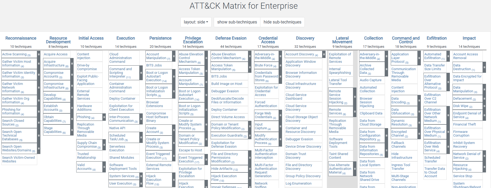 <br>
▲ Fig.MITRE_ATT&CK_Lateral_Movement_20250320

「橫向移動」戰術下的 9 項技術，分別是：

1. **Exploitation of Remote Services** (遠端服務破解)\
   攻擊者利用遠端服務（如 RDP、SSH）中的漏洞，取得對目標系統的未授權存取，進行滲透

2. **Internal Spearphishing** (內部魚叉式網路釣魚)\
   攻擊者以內部員工為目標，發動針對性魚叉式釣魚攻擊，獲取敏感資料或存取權限

3. **Lateral Tool Transfer** (橫移工具傳輸)\
   攻擊者將惡意工具或程式從一台系統移至另一台，協助進行橫向移動或擴展攻擊

4. **Remote Service Session Hijacking** (遠端服務會話劫持)\
   攻擊者劫持已建立的遠端服務會話，透過竊取會話憑證來繞過身份驗證，執行攻擊

5. **Remote Services** (遠端服務)\
   攻擊者利用遠端服務（如 RDP、VNC、SSH）連接到其他系統，控制並在內部網路擴展滲透

6. **Replication Through Removable Media** (通過可移動媒體複製)\
   攻擊者將惡意程式透過可移動媒體（如 USB）從一台設備複製到另一台，增加攻擊範圍

7. **Software Deployment Tools** (軟體部署工具)\
   利用內部合法的軟體部署工具，如 SCCM，分發惡意程式至多台機器，擴大攻擊面

8. **Taint Shared Content** (污染共享內容)\
   攻擊者在共享資料夾中植入惡意程式，當其他用戶訪問共享內容時，會被感染

9. **Use Alternate Authentication Material** (使用替代身份驗證資料)\
   攻擊者利用竊取的身份驗證資料或憑證（如 Kerberos 票證），獲得對系統的控制權

裡面並沒有 本地資料取得（Data from Local System） 故選 (D)

**但** 如果你像我一樣背不起來編號 也不知道有哪九個\
那我們來看看 (D) 本地資料取得（Data from Local System）\
本地資料取得 就是 攻擊者會搜尋本地系統來源，例如檔案系統和 config 或 本機db\
以在洩漏之前找到感興趣的檔案和敏感資料，對手可能使用 cmd 或 CLI 來執行此操作\
然而 這技術並不屬於「橫向移動」 的 而是屬於「收集」

原因是因為 本地資料取得 意思是指攻擊者從目標系統或設備中提取或竊取資料的技術\
然而這通常發生在攻擊者已經成功進入目標系統或網路並獲得一定的存取權限之後\
所以是屬於 MITRE_ATT&CK 的「收集」（Collection）範疇，而不是 橫向移動（Lateral Movement）\
故選 (D)

---
</br>

### 112-2-Q3
【複選】下列哪些攻擊手法可以透過遠端攻擊網路伺服器？\
\
(A) Ping Flooding\
(B) DDoS\
(C) 簡單配對攻擊（Secure Simple Pairing Attacks）\
(D) Wi-Fi MITM\
\
Ans : (A) (B)\
\
說明如下：

(A) (B) 我想就不多做說明了 算是很常見的 網路癱瘓攻擊\
一個是 DoS 一個則是分散式的 DDoS 我想 A B 多數人應該沒疑慮\
但 (C) (D) 就要補充一下了

(C) **簡單配對攻擊**\
指的是針對「藍牙」設備的一種攻擊方式，指在破解藍牙設備之間的配對過程\
藍牙設備通常使用簡單配對（Secure Simple Pairing, SSP）來建立加密連接並確保通信的安全性\
然而，在某些情況下，攻擊者可以利用藍牙協議中的漏洞來攔截或篡改配對過程，從而獲取設備的連接密鑰或破解加密通信\
那當然 就能做到 **中間人攻擊**

這類攻擊主要針對以下漏洞：
- 暴力破解（Brute-Force Attack）：</br>攻擊者利用對配對**密鑰**的猜測來試圖破壞加密
- 中間人攻擊（Man-in-the-Middle Attack, MITM）：</br>攻擊者介入配對過程，並有能力做到竊取或篡改配對過程中的密鑰交換，從而獲取設備控制權

(D) **Wi-Fi MITM（Man-In-The-Middle）攻擊**\
指的是攻擊者在 Wi-Fi 網絡中，通過偽造網路 AP（假 Wi-Fi 熱點），誘使用戶連接，並攔截、篡改用戶與路由器之間的通信\
攻擊者的假 AP 通常與合法熱點的名稱相似，一旦用戶連接，攻擊者便能竊取或修改通信中的敏感信息，如帳號、密碼或其他私人資料

瞭解 (C) (D) 後，這題即可果斷選擇 (A) (B)

---
</br>

### 112-2-Q18
【題組2】【複選】情境如附圖所示,承上題,資安小組在設定災難恢復目標時,\
負責資料備份與事件回應小組無法正確的擬定 RTO (Recovery Time Objective),\
看來是負責資料備份的同仁誤解了 RTO 的定義,下列哪些是正確的?\
\
(A) RTO 決定了備份政策\
(B) RTO 決定了復原政策\
(C) 業務流程中斷到恢復到可接受的服務水平所需要的最大時間\
(D) 資料備份從啟動到備份完成所需要的最短時間\
\
Ans : (A) (B)\
\
說明如下：

RTO 主要用於 **災難恢復（Disaster Recovery, DR）** 及 **業務持續性計畫（BCP）**

它決定了當系統或業務發生故障後，必須在多長時間內恢復運行，以避免超過可接受的影響範圍。\
RTO 影響企業對災難恢復技術的選擇，例如：\
  - 短 RTO（幾分鐘到數小時） ➝ 需要熱備份（Hot Backup）、高可用性架構（如雙活數據中心）。
  - 長 RTO（數小時到數天） ➝ 可使用冷備份（Cold Backup）或異地備份恢復。

(C) RTO 「恢復時間目標」 代表的是 **災難發生至恢復的最大容忍時間**\
而非「業務流程中斷」至「恢復到可接受的服務水平」，這時間不包含恢復業務服務。\
但 MTD 是企業允許的停機時間，也可以是 業務中斷 至 災難發生前的服務水平 所需要的最大時間。\
故此選項若敘述 MTD 將會正確。

(D) 指的是「備份速度」，與 RTO 並沒有太大關聯\
算是與恢復點目標 (Recovery Point Objective, RPO) 較相關。\
恢復活動使用的資訊/資料，以使活動能夠在恢復時運作的點

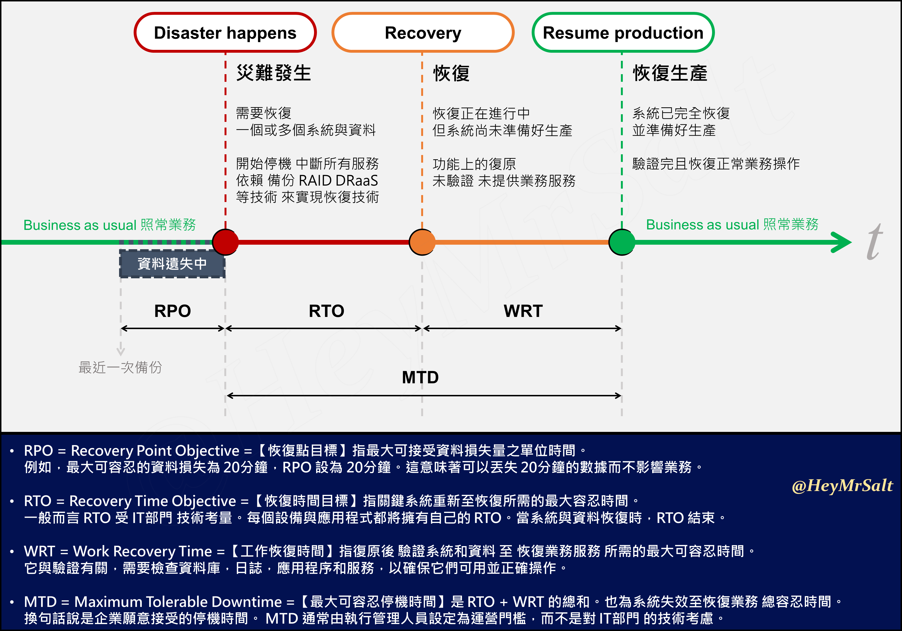 <br>
▲ Fig.RPO_RTO_WRT_MTD

---
</br>

### 112-2-Q20
依照我國「資通安全事件通報及應變辦法」的規定,當發現一般公務機密、敏感資訊、\
涉及關鍵基礎設施維運之核心業務資訊或核心資通系統遭輕微竄改之情事時,\
公務機關知悉資通安全事件後,應依規定在多少時間之內完成損害控制或復原作業,\
並依主管機關指定之方式及對象辦理通知事宜?\
\
(A) 12 小時\
(B) 24 小時\
(C) 36 小時\
(D) 72 小時\
\
Ans : (C)\
\
說明如下：

「關鍵基礎設施」之**核心業務**資訊\
「核心資通系統」遭**輕微竄改**

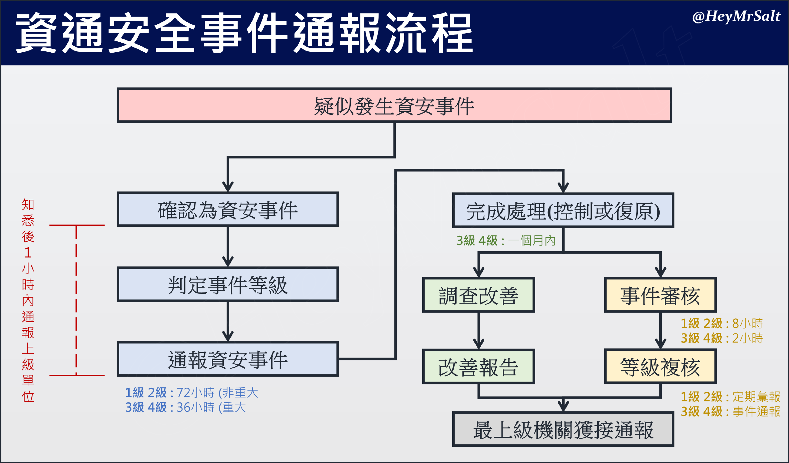 <br>
▲ Fig.Information_Security_Reporting_Process

---
</br>

## 112-1 中級 防護實務

- [【Q4】](#112-1-Q4)
- [【Q24】](#112-1-Q24)
- [【Q33】](#112-1-Q33)
- [【Q34】](#112-1-Q34)
- [【Q35】](#112-1-Q35)
- [【Q36】](#112-1-Q36)
- [【Q40】](#112-1-Q40)

### 112-1-Q4
【複選】下列哪些是目前2021版OWASP Top 10中所包含的前10種常見風險類別？\
\
(A) 權限控制失效（Broken Access Control） \
(B) 跨站請求偽造（Cross-Site Request Forgery） \
(C) 注入式攻擊（Injection）\
(D) 加密機制失效（Cryptographic Failures）\
\
Ans : (A) (C) (D)\
\
說明如下：

簡單來說，CSRF 在 2021 年並非被「移除」

而是將 CSRF 歸納到更廣泛的弱點範疇「存取控制失敗」或「不安全的設計」\
「Broken Access Control」或「Insecure Design」

且 再加上業界防禦機制日益成熟 如今大多數開發框架都內建或簡單支援像是\
CSRF Token、SameSite Cookie 等保護措施，\
導致 CSRF 在實務中遭到利用的機率相對降低，不代表不存在

---
</br>

### 112-1-Q24
【題組3】【複選】導入零信任架構時，可能面臨的威脅挑戰有下列哪些？\
\
(A) 網路的可視性\
(B) 帳密被盜/內部威脅\
(C) 遭遇 DoS 阻斷服務或網路中斷\
(D) 可建立動態存取政策的控管\
\
Ans : (A) (B) (C)\
\
各選項說明如下：

**(A) 網路的可視性** ✅
- **正確**。零信任架構強調「永不信任、持續驗證」，這要求**完整的網路可視性來監控所有存取行為**。然而，組織通常會發現難以獲取完整的流量監控，尤其是在多雲或混合環境下，這可能導致安全風險。

**(B) 帳密被盜/內部威脅** ✅
- **正確**。零信任假設內部也有風險，因此如果**帳號憑證遭竊**，或**內部人員有惡意行為**，就可能繞過部分存取控制並導致安全問題。**即使採用多因素驗證（MFA）**，攻擊者仍可能利用社交工程或其他方式竊取登入資訊。

**\(C) 遭遇 DoS 阻斷服務或網路中斷** ✅
- **正確**。零信任架構通常**仰賴集中控管和強制驗證機制**，這些系統如果遭受 **DoS（阻斷服務攻擊）**，或**核心驗證系統宕機**，可能會導致整個企業無法正常存取關鍵資源。

**(D) 可建立動態存取政策的控管** ❌
- **錯誤**。**動態存取控制是零信任的核心「優勢」，而不是挑戰**。零信任架構允許動態調整存取權限（如基於用戶行為分析、自適應身份驗證等），這反而有助於提升安全性，而不是一種威脅或挑戰。

---
</br>

【題組4】情境如下
```
OSSTMM開源安全測試方法手冊（The Open Source Security Testing Methodology Manual）其中所述
於測試安全性前應適當定義安全測試（Security Test）以妥善管理複雜性。
```

### 112-1-Q33
【題組4】關於範圍（Scope）的敘述，下列何項錯誤？\
(A) PHYSSEC實體安全（Physical Security）包含人員（Human）管道\
(B) PHYSSEC實體安全（Physical Security）包含實體（Physical）管道\
(C) SPECSEC頻譜安全（Spectrum Security）包含有線（Wired）管道\
(D) COMSEC通訊安全（Communications Security）包含資料網路（Data Networks）管道\
\
Ans : (C)\
\
原因如下：\
人員和實體層/物理層 屬於 PHYSSEC\
無線通信 屬於 SPECSEC\
電信和資料網路 屬於 COMSEC

這些資訊可以在 OSSTMM 3 Page.35 看到這個表格 (https://www.isecom.org/OSSTMM.3.pdf) <br>
OSSTMM 3 是由 ISECOM 官方所發布的資料\
下面擷取自 OSSTMM 文件上 Security Test 中的 Scope (OSSTMM 3 Page.35)

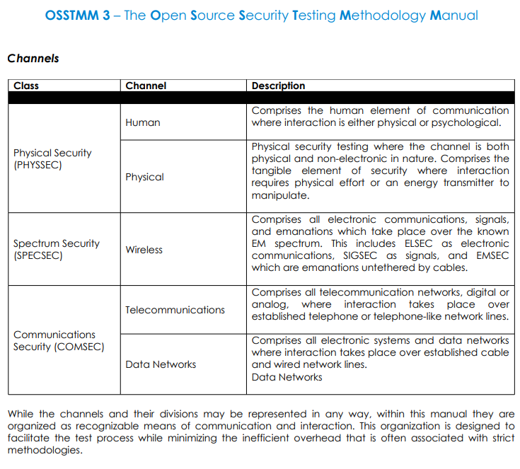 <br>
▲ Fig.OSSTMM_Security_Test_Scope_en

另自製中文版提供讀者

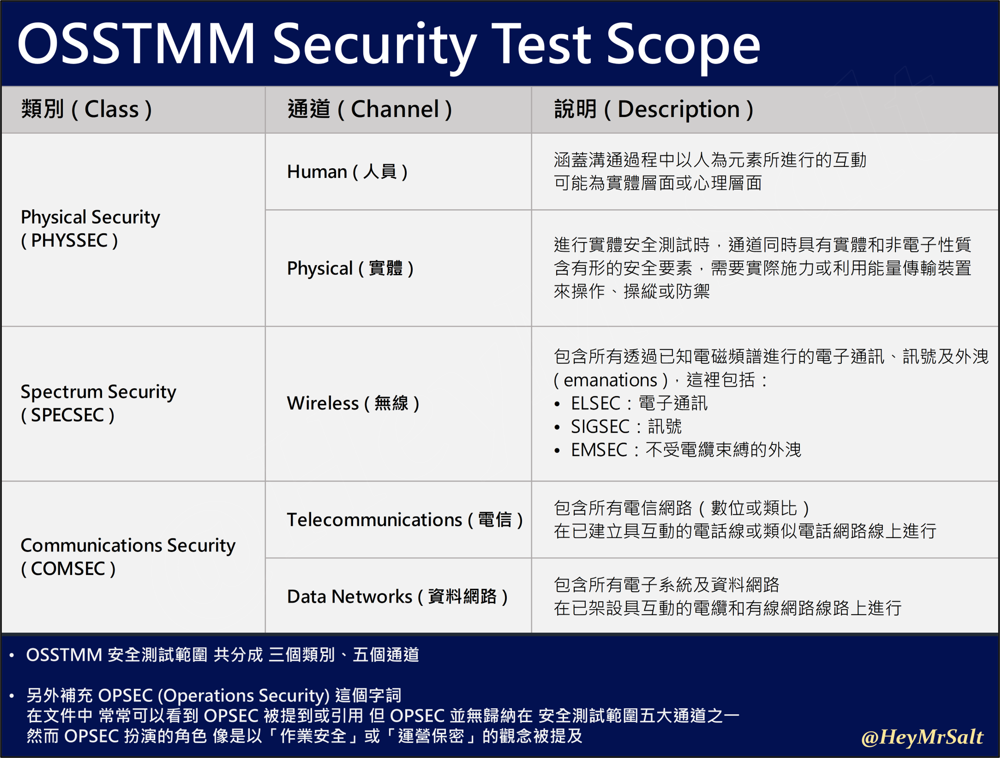 <br>
▲ Fig.OSSTMM_Security_Test_Scope_zh_TW

Refer : https://www.isecom.org/OSSTMM.3.pdf

---
</br>

### 112-1-Q34
【題組4】如附圖所示，OSSTMM 開源安全測試方法手冊（The Open Source Security Testing Methodology Manual）\
其中所述，於測試安全性前應適當定義安全測試（Security Test）以妥善管理複雜性。\
關於常見的安全測試類型，下列敘述何項錯誤？

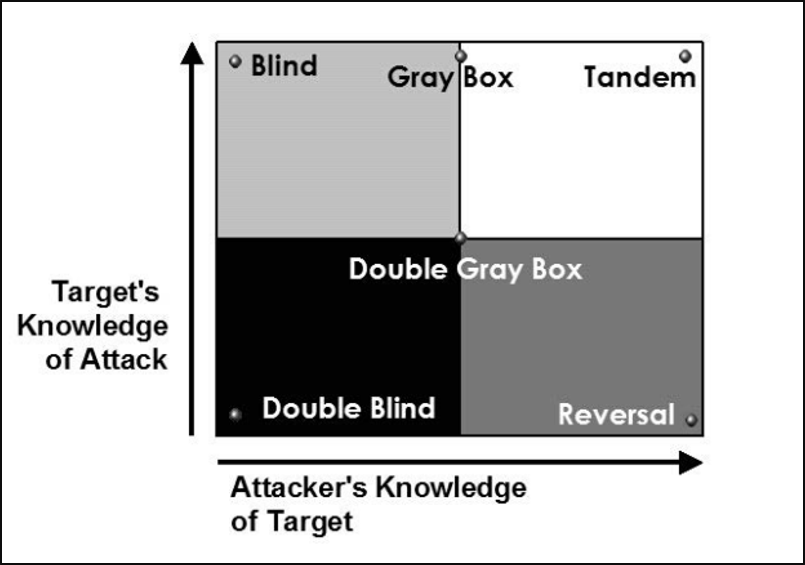 <br>
▲ Fig.112-1-Q34

(A) 盲測（Blind Test）通常也稱為藍隊演練（Blue Team Exercise）\
(B) 雙盲測試（Double Blind Test）通常也稱為滲透測試 （Penetration Test）\
(C) 灰箱測試（Gray Box Test）常被稱為弱點測試 （Vulnerability Test）\
(D) 反向測試（Reversal Test）通常也稱為紅隊演練 （Red Team Exercise）\
\
Ans : (A)\
\
盲測指的是攻擊方幾乎不了解受測方的任何細節\
攻擊者在 COMSEC 和 SPECSEC 中通常稱作道德駭客\
在 PHYSSEC 通常稱作角色扮演
Fig.112-1-Q34 這圖是來自於 OSSTMM 3 Page.36

Refer : https://www.isecom.org/OSSTMM.3.pdf

---
</br>

### 112-1-Q35
【題組4】OSSTMM 開源安全測試方法手冊（The Open Source Security Testing Methodology Manual）其中所述\
於測試安全性前應適當定義安全測試（Security Test）以妥善管理複雜性。\
關於錯誤類型（Error Type）之描述，下列何項錯誤？

(A) 假陽性（False Positive）：測試結果被判斷為真實， 但實際證明其為虛假\
(B) 假陰性（False Negative）：測試結果被判斷為虛假， 但實際證明其為真實\
(C) 抽樣誤差（Sampling Error）：測試結果不具代表性， 因為範圍被改變\
(D) 人為錯誤（Human Error）：測試結果因受測者的行 為舉止而受到改變\
\
Ans : (D)\
\
正確的人為錯誤定義應該是：\
測試過程中因測試者的失誤、判斷錯誤或操作不當而導致的錯誤。\
這可能包括數據收集錯誤、分析錯誤、或者解釋錯誤等。

因此，答案是 (D)。這個選項錯誤地將人為錯誤歸因於受測者的行為，而不是測試者的錯誤。

Refer : https://www.isecom.org/OSSTMM.3.pdf

---
</br>

### 112-1-Q36
【題組4】【複選】OSSTMM 開源安全測試方法手冊（The Open Source Security Testing Methodology Manual）其中所述\
於測試安全性前應適當定義安全測試（Security Test）以妥善管理複雜性。\
關於定義安全測試（Defining a Security Test）的描述，下列哪些正確？

(A) 定義所需保護的資產，找出其控制（Control）機制之侷限（Limitations）\
(B) 識別資產所處區域（Engagement Zone），包含相關保護機制、程序與服務\
(C) 定義測試範圍媒介（Vectors）如何內外交互，如：內到內、內到外、A 到 B 單位\
(D) 確保安全測試定義符合教戰守則（Role of Engagement）以避免誤解或錯誤期待\
\
Ans : (A) (B) (C) (D)\
\
Refer : https://www.isecom.org/OSSTMM.3.pdf

---
</br>

### 112-1-Q40
【複選】成功滲透到某個網站後，為了避免觸發相關警示而通知 IT 人員，於是採用「免殺（迴避防毒軟體的偵測）」的手法。\
發現該主機為一台 Windows 10 所搭建網站系統，決定使用 Windows 作業系統中相關工具程式來進行 Command & Control\
下面哪些 Windows 作業系統「原生」指令可以使用在遠端下載？\
\
(A) Bitsadmin.exe\
(B) Certutil.exe\
(C) HH.exe\
(D) Update.exe\
\
Ans : (A) (B) (C)\
\
各選項說明如下：

**(A) Bitsadmin.exe**
- **作用：** `bitsadmin.exe` 是 Windows 內建的 BITS（Background Intelligent Transfer Service）管理工具，攻擊者可用來**從遠端伺服器下載惡意檔案**。

**(B) Certutil.exe**
- **作用：** `certutil.exe` 是 Windows 內建的工具，主要用於管理憑證，但也可用來**下載與解碼檔案**。

**\(C) HH.exe（HTML Help Executable）**
- **作用：** `hh.exe` 是 Windows 的**CHM（HTML Help）檔案查看工具**，可以用來執行 HTML 內容，進而觸發遠端下載。

**(D) Update.exe**
- `update.exe` 通常是 Windows Update 相關的程式，並非標準的下載工具。
- 這個名稱可能出現在**特定應用程式的安裝更新工具**，但不是 Windows 內建的遠端下載工具。

---
</br>

## 111 中級 防護實務

- [【Q1】](#111-Q1)
- [【Q26】](#111-Q26)

### 111-Q1
請問下列何項惡意程式具有 SSH 劫持的能力?\
\
(A) Ebury\
(B) Azorult\
(C) MacSpy\
(D) Xtunnel\
\
Ans : (A)\
\
各選項說明如下：

**Ebury**：
- 一種 **Linux 伺服器後門**，主要用於 **SSH 憑據竊取與劫持**。
- 會感染 OpenSSH，記錄 SSH 登入憑據，並建立後門存取。
- 主要影響 Linux 與 BSD 系統，通常用於 **伺服器入侵** 和 **殭屍網路控制**。

**Xtunnel**：
- 一個與 **APT（高級持續性威脅）** 相關的惡意軟體。
- 由 APT28（Fancy Bear，俄羅斯黑客組織）使用，主要用於 **SSH 隧道轉發（Tunneling）** 來繞過防火牆，建立遠端連接。
- 曾被用於 **美國 DNC（民主黨全國委員會）** 駭客攻擊事件。

### ❌**排除選項：**

**Azorult (B)**：
- 主要是一種 **Windows 竊取木馬**，專門用於竊取 **密碼、加密貨幣錢包、瀏覽器數據**，不具備 SSH 劫持功能。

**MacSpy \(C)**：
- 主要針對 **macOS**，用於 **鍵盤側錄、螢幕截圖、麥克風錄音**，沒有專門的 SSH 劫持功能。

#### **SSH 劫持的類型**
1. **SSH Session Hijacking（會話劫持）**
    - 駭客在目標系統上取得 **root 權限**，直接**接管現有的 SSH 會話**（Session）。
    - 方式：
        - 利用 `ptrace`（Linux 偵錯機制）來**附加到 SSH 進程**，控制當前的 SSH 連線。
        - 修改 SSH 會話記錄 (`/dev/tty` 或 `/proc/<pid>/fd/0`)，劫持輸入輸出。
    - **實例**：惡意程式 **Ebury** 可劫持 SSH 會話，讓攻擊者在不重新認證的情況下控制伺服器。
2. **SSH Credential Hijacking（憑證劫持）**
    - 駭客竊取 **SSH 憑據（帳號/密碼或私鑰）**，然後用來登入受害者的伺服器。
    - 方式：
        - **鍵盤側錄**（Keylogging）
        - **感染 OpenSSH 進程**，記錄輸入的密碼（如 Ebury）。
        - **中間人攻擊（MITM）**，攔截 SSH 登入請求（如 DNS 欺騙+惡意 SSH 伺服器）。
3. **SSH Tunneling Hijacking（隧道劫持）**
    - 駭客利用 SSH 隧道技術來繞過防火牆，建立遠端連線，或**劫持 SSH 流量**來竊取數據。
    - **實例**：APT28（Fancy Bear）使用 **Xtunnel** 來劫持 SSH 隧道並進行間諜活動。

---
</br>

【題組2】情境如下
```
勒索病毒（Ransomware）成為企業政府頭疼的資安問題，在面對新穎勒索病毒與散布方式，並無百分百對策。
上層長官要求提出針對勒索病毒防護的安全架構規劃，常見就是防毒系統更新建置為其中一個對策。
您是某公司的資安工程師，在全單位都是微軟作業系統的環境下，關於對策方案之減損（減災）
```

### 111-Q26
【題組2】駭客勒索集團會利用網路釣魚方式，達成加密勒索目的，讓公司蒙受重大損失。\
身為公司資安人員，必須全面瞭解掌握各類駭客釣魚的方式，才能對公司高層提出有效防護對策。\
關於常見之駭客釣魚方式，下列敘述何者正確？\
(A) 鯨釣（Whaling）：\
針對特定人員、公司、組織的發送，目標為釣取特定人員機敏資料或於其電腦植入木馬\
(B) 魚叉式釣魚（Spear Phishing）：\
瞄準大型公司、重要人物發送特定釣魚郵件的攻擊\
(C) 複製型釣魚（Clone Phishing）：\
攻擊者使用某些方法密切監視受害者收件匣。\
攻擊者會收受害者近期電子郵件最好有連結或附件並進行複製偽造 \
(D) 語音釣魚（Voice Phishing）：\
或稱vishing會假冒為受害者信任的個人或單位，利用語音通話與各種話術，\
試圖從受害者取得各種機敏資訊，只限定在電話詐騙，不會使用在電子郵件中\
\
Ans : (C)\
\
讓我們逐個分析選項:
```
(A) 問題在於目標對象過於寬泛 方法也太狹隘
鯨釣 是野心大 胃口大的 針對像是 CEO 這種大魚 (極高階管理人員
去詐騙做出資金轉移 或 去騙取極敏感性資訊 利用電子郵件等方式 而非單一「植入木馬」
與隨機進行之網路釣魚不同
```
```
(B) 問題在於限定目標太狹窄
魚叉式釣魚 本就是一種「鎖定特定目標」的精準詐騙手法
攻擊者會先蒐集目標的背景資訊，再客製化電子郵件或訊息，以提高可信度
描述中只強調「大型公司」與「重要人物」，忽略了這類攻擊也常針對普通但資訊豐富的員工
這樣的描述容易讓人誤以為只有大型企業才會發生魚叉式釣魚，而忽視中小企業與一般個人也會遭受此類攻擊
這種攻擊常見於 APT , 滲透 或 資安威脅中，因為具較高的成功率與滲透深度
魚叉式釣魚 也是滲透方法之一 透過惡意的電子郵件來輔助其發動 針對性攻擊/鎖定目標攻擊 (Targeted attack) 
```
```
(C) 選項無誤
攻擊者利用已知的、受害者曾經收到的合法郵件作為模板，僅更換其中的連結或附件，使其變成帶有惡意內容的版本，再發送給受害者。
```
```
(D) 問題在於攻擊媒介的界定過於絕對
語音釣魚 一詞來自 [語音+網路釣魚] 是一種 社交工程 手法，攻擊者會偽裝成他人來電欺騙 或是語音 視訊 等多個通訊提高受害率。
常以緊急 甚至帶有脅迫性的電話形式出現，像是受害者的帳戶被盜，來電者需要密碼來驗證身份
某些攻擊案例中，攻擊者可能先透過電子郵件或短信安排「回電」的時間，然後再以電話進行詐騙。
說明選項「只限定在電話詐騙」顯得過於狹隘，雖然核心攻擊手法仍為語音，但輔以其他信道輔助使詐騙更具欺騙性。
```
```
(B) 與 (C) 情境舉例
魚叉式釣魚（Spear Phishing）與複製型釣魚（Clone Phishing）最大的差異在於攻擊者製作郵件的方式及攻擊流程不同。

情境一：魚叉式釣魚（Spear Phishing）

假設有一位財務部門的員工小明，負責處理公司內部的支付事務。攻擊者事先研究了小明的工作內容、主管姓名以及近期公司公告，便設計了一封針對性極強的電子郵件。
攻擊者偽裝成小明的財務主管，發送一封內容非常符合公司內部溝通風格的郵件。
郵件中提到一個緊急且機密的支付指令，要求小明點擊郵件中的連結以查看詳情或下載相關指令文件。
小明因為郵件內容專門針對他的工作與職責，認為該郵件極具可信度，點擊連結後便中招下載了惡意軟體或提供了機敏資訊。

情境二：複製型釣魚（Clone Phishing）

假設公司內部定期會收到來自 IT 部門的軟體更新通知郵件，郵件中附有一個看似正常的更新連結。這封郵件原本是完全合法且安全的。
攻擊者成功監聽或取得一封該合法郵件的內容。
接著，攻擊者複製整封郵件內容，並將原本的連結或附件替換為經過修改、帶有惡意程式碼的版本。
攻擊者再次以相似的郵件地址發送這封偽造的更新通知給受害者，因為內容與先前合法郵件一模一樣，受害者誤以為是原本的通知而點擊連結或下載附件，進而中招。

小結
魚叉式釣魚：攻擊者根據目標個人的背景及職責，從零開始設計一封看似合法且具針對性的郵件，藉此誘使受害者主動執行某些行動。
複製型釣魚：攻擊者利用已知的、受害者曾經收到的合法郵件作為模板，僅更換其中的連結或附件，使其變成帶有惡意內容的版本，再發送給受害者。
```

---
</br>

# 資安重要專有名詞

- [【資通安全事件通報流程】](#資通安全事件通報流程)
- [【常見Port號】](#常見Port號)
- [【白箱黑箱】](#白箱黑箱)
- [【XaaS】](#XaaS)
- [【SIEM vs IDS】](#SIEM-vs-IDS)
- [【APT 名詞說明 以及 常用技術手法】](#APT-名詞說明-以及-常用技術手法)
- [【Cyber Kill Chain】](#Cyber-Kill-Chain)
- [【OWASP Top 10 的詳細解釋】](#OWASP-Top-10-的詳細解釋)
- [【DDoS攻擊種類之對應OSI層級】](#DDoS攻擊種類之對應OSI層級)
- [【CVSS】](#CVSS)
- [【SSDLC vs DevSecOps】](#SSDLC-vs-DevSecOps)
- [【SQL injection 類型】](#SQL-injection-類型)
- [【待更新-中間人攻擊MITM】](#中間人攻擊MITM)
- [【魚叉式網釣】](#魚叉式網釣)
- [【0-day零時差漏洞】](#0-day零時差漏洞)
- [【Other-days】](#Other-days)
- [【Credentials vs Certificates】](#Credentials-vs-Certificates)

</br>

## 資通安全事件通報流程
> 已粗略整理成下圖

 <br>
▲ Fig.Information_Security_Reporting_Process

---
</br>

## 常見Port號
> 已粗略整理成下表

| 連接埠 (Port)           | TCP/UDP  | 服務 / 協定                                  | 用途 / 說明                                                        |
|-------------------------|----------|----------------------------------------------|---------------------------------------------------------------------|
| 20, 21                  | TCP      | FTP (File Transfer Protocol)                | 檔案傳輸；20 為資料連接、21 為指令控制                              |
| 22                      | TCP      | SSH (Secure Shell)                          | 安全遠端登入、加密傳輸                                              |
| 23                      | TCP      | Telnet                                      | 明文遠端登入，不安全                                                |
| 25, 465                 | TCP      | SMTP (Simple Mail Transfer Protocol)        | 郵件傳送；25 為明文、465 為加密 (SMTPS)                              |
| 53                      | TCP/UDP  | DNS (Domain Name System)                    | 網域名稱查詢與解析                                                  |
| 67, 68                  | UDP      | DHCP (Dynamic Host Configuration Protocol)  | 自動分配 IP；67 為伺服器、68 為客戶端                                |
| 69                      | UDP      | TFTP (Trivial File Transfer Protocol)       | 簡易檔案傳輸，無驗證與加密機制                                      |
| 80                      | TCP      | HTTP (Hypertext Transfer Protocol)          | 明文的網站傳輸                                                      |
| 110, 995                | TCP      | POP3 (Post Office Protocol 3)               | 收取郵件；110 為明文、995 為加密 (POP3S)                            |
| 119                     | TCP      | NNTP (Network News Transfer Protocol)       | 網路新聞群組 (Usenet)                                               |
| 123                     | UDP      | NTP (Network Time Protocol)                 | 網路時間同步                                                        |
| 137, 138, 139           | UDP/TCP  | NetBIOS                                     | Windows 網段檔案、印表機共用與名稱服務                              |
| 143, 993                | TCP      | IMAP (Internet Message Access Protocol)     | 收取與管理郵件；143 為明文、993 為加密 (IMAPS)                      |
| 161, 162                | UDP      | SNMP (Simple Network Management Protocol)   | 161 用於管理查詢、162 為 Trap (主動回報)                            |
| 389, 636                | TCP/UDP  | LDAP (Lightweight Directory Access Protocol)| 389 為明文查詢、636 為加密 (LDAPS)                                  |
| 443                     | TCP      | HTTPS (HTTP over SSL/TLS)                  | 加密的網站傳輸                                                      |
| 445                     | TCP      | SMB (Server Message Block)                  | Windows 網路檔案共用                                                |
| 548                     | TCP      | AFP (Apple Filing Protocol)                 | Apple 裝置檔案共用                                                  |
| 1433                    | TCP      | Microsoft SQL Server                        | MS SQL 預設通訊埠                                                   |
| 1521                    | TCP      | Oracle Database                             | Oracle 預設通訊埠 (TNS Listener)                                    |
| 3306                    | TCP      | MySQL                                       | MySQL 預設通訊埠                                                    |
| 3389                    | TCP/UDP  | RDP (Remote Desktop Protocol)               | Windows 遠端桌面                                                    |
| 5900                    | TCP      | VNC (Virtual Network Computing)             | 遠端視窗控制                                                        |
| 8080, 8443              | TCP      | HTTP Proxy / Alternate HTTP                 | 8080 為常見代理或替代 HTTP、8443 用於 HTTPS Proxy 或管理介面         |
| 5060, 5061              | TCP/UDP  | SIP (Session Initiation Protocol)           | VoIP 建立多媒體通話；5060 為明文、5061 為加密 (TLS)                  |

> 同上已粗略整理成下圖 (表格跑掉可改看圖)

 <br>
▲ Fig.Common_Port

> 紅字為個人評估必知項目，但最好全部都要瞭解\
> 此外也額外補充這些Port可能面臨的風險以及相關安全資訊

---
</br>

## 白箱黑箱
> 已粗略整理成下表

| 測試方法                                          | 定義                                                                      | 適用階段                                                     |
|--------------------------------------------------|---------------------------------------------------------------------------|-------------------------------------------------------------|
| 白箱測試</br>（White-box Testing）                | 測試者擁有對應用程式內部結構、擁有 Source Code </br> 和運作邏輯的完全訪問權限  | 主要在開發早期進行，</br>協助開發人員修復缺陷或漏洞             |
| 黑箱測試</br>（Black-box Testing）                | 測試者對應用程式的內部結構一無所知，</br>只關心其功能和輸出結果                | 適用於測試部署後的應用程式，</br>確保其在真實環境中的安全性      |
| 灰箱測試</br>（Gray-box Testing）                 | 結合黑白箱測試，交互驗證其結果，</br>既模擬外部攻擊者，又利用部分內部資訊       | 適用於中後期的測試階段，</br>特別是在開發和測試團隊需合作之情況  |

以下是關於 **白箱測試**、**黑箱測試**、**灰箱測試**，以及相關安全測試方法的整理表格：

**其他相關測試：**

- **靜態應用程式安全測試（SAST）**：
  - **定義**：別名為白箱測試，在不執行程式的情況下，分析源代碼或二進位碼，以發現安全漏洞

- **動態應用程式安全測試（DAST）**：
  - **定義**：別名為黑箱測試，在應用程式運行時，模擬外部攻擊者的行為，測試其安全性

- **互動式應用程式安全測試（IAST）**：
  - **定義**：結合 SAST 和 DAST 的優點，在應用程式運行時進行動態監控，實時發現漏洞

- **軟體組成分析（SCA）**：
  - **定義**：分析應用程式中使用的開源和第三方 Lib庫，檢查其安全性

在現代的 DevSecOps 流程中，綜合運用這些測試方法，並結合 IAST 和 SCA 等工具\
能夠在應用程式的整個生命周期中持續進行安全檢測與監控，確保應用程式的安全性和可靠性

#本筆記這處也有提到相關資訊 點擊查看更多學習資訊 [【SSDLC vs DevSecOps】](#SSDLC-vs-DevSecOps)

---
</br>

## XaaS

XaaS 把 X 當任意解讀... 所以就是 "Anything as a Service" 或 "Everything as a Service"\
是一種雲端服務模式，涵蓋了各種透過網路提供的服務。以下是一些常見的 XaaS 類型：​

1. **SaaS（Software as a Service，軟體即服務）**：</br>提供完整的應用程式服務，使用者無需安裝和維護軟體即可使用。</br>例如：Google Workspace、Dropbox、Salesforce 等

2. **PaaS（Platform as a Service，平台即服務）**：</br>提供開發、測試和部署應用程式的平台，開發者可以在此環境中構建應用，而無需關心底層基礎設施。</br>例如：Google App Engine、Microsoft Azure 等

3. **IaaS（Infrastructure as a Service，基礎設施即服務）**：</br>提供虛擬化的計算資源，如伺服器、儲存和網路，使用者可根據需求進行擴展。</br>例如：Amazon Web Services（AWS）、Google Cloud Platform 等

4. **DaaS（Data as a Service，資料即服務）**：</br>提供資料存取和處理服務，使用者可以在雲端存取和分析資料。</br>例如：Snowflake、Oracle 等

5. **NaaS（Network as a Service，網路即服務）**：</br>提供虛擬化的網路服務，包括虛擬專用網路（VPN）、帶寬按需等功能。</br>例如：Perimeter81 等

6. **BaaS（Backend as a Service，後端即服務）**：</br>為行動應用程式開發者提供雲端後端服務，如資料儲存、用戶驗證等功能。</br>例如：Firebase、Parse 等

7. **FaaS（Function as a Service，功能即服務）**：</br>允許開發者部署單一功能的雲端運算服務，通常用於事件驅動的應用程式。</br>例如：AWS Lambda、Google Cloud Functions 等

8. **CaaS（Container as a Service，容器即服務）**：</br>提供容器管理和部署的雲端服務，方便開發者管理容器化應用。</br>例如：Google Kubernetes Engine、Amazon ECS 等

9. **AIaaS（Artificial Intelligence as a Service，人工智慧即服務）**：</br>提供人工智慧和機器學習功能的雲端服務，使用者可利用這些服務進行資料分析和模型訓練。</br>例如：IBM Watson、Google AI 等

10. **MaaS（Monitoring as a Service，監控即服務）**：</br>提供系統和應用程式監控的雲端服務，協助企業監測其基礎設施的運行狀態。</br>例如：Datadog、New Relic 等

這些服務類型展示了 XaaS 模式的多樣性，企業和個人可以根據需求選擇適合的服務，以提高效率和降低成本

另外還有 PhaaS 即 Phishing-as-a-Service（網路釣魚即服務）是詐騙集團會使用的一種 **新興的網路犯罪服務模式**\
使得即使缺乏技術知識的犯罪分子也能輕易發起網路釣魚攻擊...

**PhaaS 的運作方式：**

- **服務提供**：</br>犯罪分子提供網路釣魚工具和服務，其他人可以購買或租用這些服務來發起攻擊
- **降低技術門檻**：</br>傳統上，發起網路釣魚攻擊需要一定的技術知識，但 PhaaS 平台提供現成的模板和工具，讓技術能力有限的人也能輕鬆發動攻擊
- **自動化攻擊**：</br>這些服務通常提供自動化功能，允許攻擊者批量發送釣魚郵件或建立釣魚網站，從而提高攻擊效率

**防範 PhaaS 攻擊的建議：**

- **員工培訓**：</br>定期對員工進行網路安全培訓，提高他們識別釣魚郵件的能力
- **多因素驗證**：</br>啟用多因素驗證（MFA），即使帳號密碼被盜，攻擊者也難以入侵系統
- **電子郵件過濾**：</br>使用先進的電子郵件過濾系統，攔截可疑的郵件內容和附件
- **定期安全測試**：</br>進行定期的安全測試，如紅隊演練，模擬 PhaaS 攻擊，發現並修補潛在漏洞

也確實，隨著 PhaaS 模式的興起，網路釣魚攻擊變得更加複雜和普遍。\
除了企業 個人也需提高警覺，採取積極的防護措施，以應對這一日益嚴峻的威脅

#本筆記這處也有提到相關資訊 點擊查看更多學習資訊 [【魚叉式網釣】](#魚叉式網釣)

---
</br>

## SIEM vs IDS

-   SIEM 安全資訊與事件管理：\
    Security Information and Event Management\
    核心功能：集中收集並分析多個數據來源（網路設備、防火牆、IDS、程式日誌等）\
    核心價值：可透過機器學習，將分散的事件關聯起來，偵測大型或複雜攻擊\
    讓管理者在同一平台查看所有安全事件，發現可疑活動會自動警報\
    便於進行稽核以及調查取證（如 ISO 27001、GDPR 等）
-   IDS 入侵偵測系統：\
    Intrusion Detection System\
    核心功能：透過監控網路或系統流量，識別可疑行為或已知攻擊模式\
    分兩種類\
    1 - NIDS（Network-based IDS）\
    部署在網路層，監控網路封包並比對攻擊特徵 (Signature-based) 或可疑行為 (Anomaly-based)\
    2 - HIDS（Host-based IDS）\
    安裝於主機端，透過監控主機上的檔案、日誌、系統呼叫等方式偵測入侵\
    限制：僅能發現潛在攻擊，若要攔截或防禦，多搭配 IPS（Intrusion Prevention System）
-   比較表：

| **項目**             | **IDS** (入侵偵測系統)                         | **SIEM** (安全資訊與事件管理)                              |
| -------------------- | --------------------------------------------- | ---------------------------------------------------------- |
| **主要目的**         | 偵測網路或系統層級的可疑行為或攻擊跡象         | 整合並關聯分析各來源的安全事件/日誌                        |
| **資料來源**         | 即時封包、系統行為 (網路/主機)                 | 各種系統日誌、安全產品 (防火牆、IDS、IPS、伺服器、應用程式) |
| **作用範疇**         | 重點在「偵測」，不一定負責阻擋攻擊             | 重點在「收集、分析、關聯」事件，提供即時警示與報表         |
| **即時防禦**         | IDS 只「偵測」，不一定阻擋；若要阻擋通常需 IPS | 具備「分析」與警示功能，但阻擋需靠其他安全控制             |
| **稽核支援**         | 不具備或非常有限                             | 提供報告、儀表板，幫助稽核要求          |

-   結論：\
    **IDS** 著重「特定點」或「局部」的入侵偵測（網路/主機），即時但範圍有限\
    **SIEM** 更像是「整合分析平台」，將多來源資料收斂再進行關聯分析，提供全局視野與合規報告\
    兩者間非互斥，反而常被整合

---
</br>

## APT 名詞說明 以及 常用技術手法

### 名詞
* APT（Advanced Persistent Threat，高級持續性威脅）攻擊
* 是一種精密、長期、且持續的網絡攻擊方式，
* 攻擊者會使用多種技術手法來達成他們的目的。
* 以下是 APT 攻擊中常用的技術手法的詳細解釋：

### 1. **Privilege Escalation（提權）**：
   - **定義**：Privilege Escalation（提權）是指攻擊者通過利用系統漏洞或錯誤設定<br>　　　將自己的權限從低權限（例如普通使用者）提升到更高的權限（如管理員或系統級權限）的過程。
   - **作用**：提權是 APT 攻擊中非常關鍵的一步，因它可讓攻擊者獲得更大的系統控制權，而執行更多高級操作。<br>　　　例如，攻擊者本只能存取一個普通帳戶，但通過提權，<br>　　　他們能夠獲得對系統或網路的完全控制，進行任意讀取、系統設定更改或安裝惡意軟體。
   - **方法**：
     - **漏洞利用**：利用已知的或未公開的（零日）漏洞來提升權限。
     - **錯誤設定**：系統或應用程式不當設定之權限也可能被利用。
     - **憑證竊取**：攻擊者可能會竊取高權限用戶的憑證（如密碼或 token），來冒充該使用者。

### 2. **Lateral Movement（橫向移動）**：
   - **定義**：Lateral Movement（橫向移動）是指攻擊者在獲得初始系統進入點後<br>　　　在網絡中橫向擴展，進一步攻擊其他系統或資源的過程。
   - **作用**：橫向移動的目的是在網絡內部擴展攻擊範圍，尋找更多敏感訊息或更高價值目標。<br>　　　APT 攻擊者往往不滿足於入侵單一系統，而是會試圖進一步擴展他們的控制範圍<br>　　　以便最終達到入侵目標系統或獲取關鍵數據之目的。
   - **方法**：
     - **使用已獲取的高權限**：在提權後，攻擊者會利用管理員或系統權限進行橫向移動。
     - **憑證轉移攻擊**：通過竊取或重用在網絡中的使用者憑證，攻擊者可以進一步侵入其他系統。
     - **遠端桌面協議（RDP）或 Windows 管理工具**：攻擊者利用網路中的合法工具，像是 RDP 或 WMI，來在不同系統之間移動，而不引起系統防禦警報。

### **APT 攻擊中的應用**：
   - **提權和橫向移動**這兩個技術手法是 APT 攻擊中的常見步驟。<br>通常，攻擊者會先取得某個系統的初步訪問權限（可能是透過魚叉式網釣、社交工程或已知漏洞）<br>然後使用提權技術來提升自己的權限，接著再利用橫向移動技術在目標網絡內擴展控制範圍，最終達到攻擊目標。

### 總結：
   - 這些技術手法是 APT 攻擊持續性和高威脅性的核心所在<br>讓攻擊者能夠在被入侵系統內進行深度滲透並保持「長時間隱蔽」

這邊的憑證指的都是 Credentials\
過去我曾花時間細細研究 Credentials vs Certificates\
由於翻譯都可以叫做「憑證」因此定義上常常讓人搞混\
這方面有興趣可以看我整理的筆記【Credentials vs Certificates】

[待更新] #本筆記這處也有提到相關資訊 點擊查看更多學習資訊 [【Credentials vs Certificates】](#Credentials-vs-Certificates)\
[待更新] #本筆記這處也有提到相關資訊 點擊查看更多學習資訊 [【魚叉式網釣】](#魚叉式網釣)\
[待更新] #本筆記這處也有提到相關資訊 點擊查看更多學習資訊 [【0-day零時差漏洞】](#0-day零時差漏洞)

### **APT 典型的攻擊過程示意圖**：

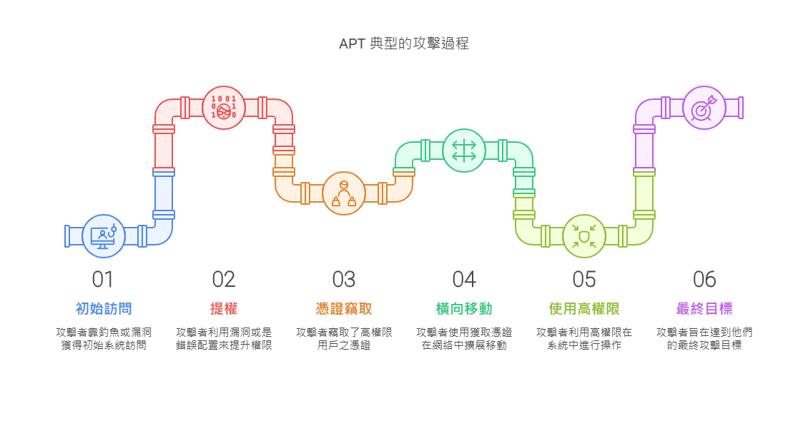 <br>
▲ Fig.APT_Attack_Chain

Refer : ChatGPT_o1

一般來說 APT 攻擊確實常被整理成如圖中所示。不過要注意的是：

1. APT 沒有「唯一」標準流程<br>
   不同的資安研究機構或框架（例如 MITRE ATT&CK、Lockheed Martin Kill Chain 等）<br>對 APT 的階段可能會有不同名稱或拆分方式，但大致思路都相似。<br>
   攻擊者會先想辦法取得初步 foothold，然後不斷擴大對系統的控制權限或取得敏感憑證<br>再深入橫向擴散，最後達成既定目標（如竊取資料、取得關鍵系統控制權等）。

2. 實務上不需要「嚴格依序」<br>
   實際攻擊過程可能視情況跳過某些步驟，或是在某個階段反覆執行多次<br>例如在橫向移動前就先蒐集大量憑證，也可能在已取得高權限後仍再度提權或蒐集不同帳號的憑證<br>

總結，此圖僅為示意圖，實務上仍會依個案情境而略有不同。<br>

---
</br>

## Cyber Kill Chain

1. 偵查 Reconnaissance: <br>攻擊者收集目標對象的資料，如電子郵件信箱、社群平台的資料，以找到可以下手的弱點；或是透過工具，掃描目標對象的網站、系統，得知使用的系統種類、版本。
2. 武裝 Weaponization: <br>攻擊者使用現成的開源工具或是自行開發專屬的惡意程式。
3. 遞送 Delivery: <br>攻擊者將攻擊武器送入目標的系統內，如透過釣魚信件裡的連結、夾帶木馬的盜版軟體、隨身碟。
4. 漏洞利用 Exploitation: <br>確保遞送的惡意軟體，藉由目標對象的系統漏洞，得以順利開啟，並使攻擊者獲得控制權。
5. 安裝 Installation: <br>攻擊者確保自身可以長期控制目標的系統內，以有足夠的時間進行後續環節。
6. 發令與控制 Command & Control: <br>本環節取兩個單字的字首，又可簡稱為 C2。攻擊者潛伏在目標的系統內，收集資料，探索環境，以便審慎規劃後續行動。
7. 行動 Actions: <br>根據攻擊者的最終目標，採取行動，如破壞系統、竊取機密資料、勒索目標對象。

Refer : https://teamt5.org/tw/posts/what-is-cyber-kill-chain

---
</br>

## OWASP Top 10 的詳細解釋
>  From 2021年 發佈

### 1. 失效的存取控制 (Broken Access Control):
> 存取控制的機制若實作不當，可能導致使用者能取得或修改並不屬於自身權限範圍的資料或功能
* 定義: 這是指系統未能正確限制用戶對某些資源或功能的訪問。
* 詳細說明:
    * 垂直權限升級: 普通用戶可以執行只有管理員才能執行的操作。
    * 水平權限升級: 用戶A可以訪問用戶B的數據。
    * 目錄遍歷: 攻擊者可以訪問系統目錄中的敏感文件。
    * 未經授權的API訪問: API端點缺乏適當的訪問控制。
* 影響:
    * 數據洩露
    * 系統被完全接管
    * 聲譽損害
* 防禦方法:
    * 實施最小權限原則
    * 使用角色基礎的存取控制(RBAC)
    * 強制執行適當的會話管理
    * 在服務器端驗證所有存取控制決策
    * 禁用目錄列表
    * 定期審核和測試存取控制機制
### 2. 加密機制失效 (Cryptographic Failures):
> 涉及敏感資料在傳輸或儲存時，若採用不安全或不恰當的加密方式（例使用舊版或弱化演算法）將導致資料洩露的風險
* 定義: 這包括與數據保護相關的問題,特別是加密方面的失誤。
* 詳細說明:
    * 使用過時或弱加密算法(如MD5, SHA1)
    * 使用固定或可預測的加密密鑰
    * 不正確的證書驗證
    * 在客戶端存儲敏感數據
* 影響:
    * 敏感數據洩露(如密碼、信用卡信息)
    * 身份盜竊
    * 財務損失
* 防禦方法:
    * 使用強加密算法(如AES, RSA)
    * 實施適當的密鑰管理
    * 使用安全的隨機數生成器
    * 加密所有傳輸中和靜止狀態的敏感數據
    * 禁用較弱的加密協議和密碼套件
### 3. 注入 (Injection):
> 包括 SQL、NoSQL、OS 等不同形式的注入攻擊。若未正確過濾或驗證使用者輸入，就會被利用惡意輸入來執行非預期指令或查詢。
* 定義: 攻擊者能夠將惡意代碼注入應用程序,並在處理時執行。
* 詳細說明:
    * SQL注入: 攻擊者通過操縱輸入來修改SQL查詢。
    * 命令注入: 攻擊者能夠在系統上執行操作系統命令。
    * LDAP注入: 攻擊者可以操縱LDAP查詢。
    * XPath注入: 攻擊者可以修改XML查詢。
* 影響:
    * 未經授權的數據訪問和修改
    * 數據庫完整性損壞
    * 遠程代碼執行
* 防禦方法:
    * 使用參數化查詢
    * 使用ORM框架
    * 輸入驗證和轉義
    * 最小權限原則
    * 使用存儲過程(謹慎使用)
### 4. 不安全的設計 (Insecure Design):
> 在系統架構、設計階段就缺乏適當的安全考量。這種結構性缺陷，往往難以在後期修補來根治，需在設計階段就將安全考量納入。
* 定義: 在軟件設計階段就存在的安全缺陷。
* 詳細說明:
    * 缺乏適當的安全控制
    * 未考慮到所有可能的攻擊場景
    * 過度信任用戶輸入或外部系統
    * 不安全的數據流
* 影響:
    * 系統級別的安全漏洞
    * 難以修復的深層次問題
    * 可能導致多個其他安全問題
* 防禦方法:
    * 進行威脅建模
    * 實施安全開發生命週期(SDL)
    * 進行安全架構審查
    * 採用"安全即設計"的理念
    * 定期進行滲透測試和代碼審查
### 5. 安全設定錯誤 (Security Misconfiguration):
> 包含預設設定未更改、不必要的功能啟用、權限未適當配置、錯誤處理不恰當等，都可能使得系統更易遭攻擊。
* 定義: 系統、框架、應用程序或服務器的配置不當或不安全。
* 詳細說明:
    * 使用默認密碼或弱密碼
    * 啟用不必要的功能、端口或服務
    * 錯誤處理機制暴露敏感信息
    * 缺少適當的安全標頭
    * 軟件過時或有漏洞
* 影響:
    * 未經授權的系統訪問
    * 系統信息洩露
    * 增加其他攻擊的成功率
* 防禦方法:
    * 採用"最小化"原則,只啟用必要的功能
    * 自動化配置和修補過程
    * 強密碼策略
    * 定期進行安全審計和掃描
    * 實施安全標頭和適當的錯誤處理
### 6. 易受攻擊和過時的元件 (Vulnerable and Outdated Components):
> 使用庫、框架、其他軟體元件的舊版本或已知存在漏洞的版本，可能讓攻擊者利用既有弱點輕易取得系統控制權。
* 定義: 使用具有已知漏洞的庫、框架或其他軟件模塊。
* 詳細說明:
    * 使用過時的第三方庫
    * 未及時應用安全補丁
    * 客戶端庫的不安全配置
    * 繼續使用不再維護的軟件
* 影響:
    * 可能導致各種攻擊,取決於漏洞的性質
    * 系統可能被輕易入侵
* 防禦方法:
    * 定期更新所有依賴項
    * 使用軟件組成分析(SCA)工具
    * 訂閱安全公告
    * 實施虛擬補丁策略
    * 只使用官方和可信的來源
### 7. 身分驗證與識別失效 (Identification and Authentication Failures):
> 涉及用戶驗證、Session 管理等機制實作不當，可能被駭客利用來冒用他人身分或竊取 Session 以獲取敏感資訊。
* 定義: 身份驗證和會話管理相關的問題
* 詳細說明:
    * 允許弱密碼
    * 不安全的密碼恢復機制
    * 缺少多因素認證
    * 會話固定攻擊
    * 不安全的會話管理
* 影響:
    * 未經授權的賬戶訪問
    * 身份盜竊
    * 會話劫持
* 防禦方法:
    * 實施強密碼策略
    * 使用多因素認證
    * 實施安全的會話管理
    * 限制失敗登錄嘗試
    * 使用安全的密碼存儲技術(如bcrypt)
### 8. 軟體和資料完整性失效 (Software and Data Integrity Failures):
> 若應用程式沒有檢驗軟體更新、關鍵資料或程式碼的完整性（例如未驗證簽章），則攻擊者可藉此置換內容或進行惡意注入。
* 定義: 代碼和數據在處理或存儲過程中未能維護其完整性。
* 詳細說明:
    * 不安全的反序列化
    * 使用不受信任的數據或代碼
    * 軟件更新過程中的完整性檢查失敗
    * CI/CD管道中的安全問題
* 影響:
    * 代碼執行
    * 數據操縱
    * 軟件供應鏈攻擊
* 防禦方法:
    * 使用數字簽名
    * 實施完整性檢查
    * 使用安全的反序列化技術
    * 對CI/CD管道進行安全審計
    * 實施軟件供應鏈安全措施
### 9. 安全記錄和監控不足 (Security Logging and Monitoring Failures):
> 由於缺乏可靠的日誌記錄與監控機制，當安全事件發生時，可能無法及時偵測、調查或追蹤到問題根源。
* 定義: 缺乏足夠的日誌記錄、檢測、監控和主動響應。
* 詳細說明:
    * 可審核事件未被記錄
    * 警告和錯誤生成不清晰的日誌消息
    * 日誌未被監控或實時告警
    * 滲透測試和掃描無法觸發告警
* 影響:
    * 無法檢測和響應安全事件
    * 延遲事件響應和取證
    * 無法追踪攻擊者的活動
* 防禦方法:
    * 實施集中式日誌管理
    * 設置實時監控和告警系統
    * 確保日誌包含足夠的上下文信息
    * 定期審查和分析日誌
    * 實施安全信息和事件管理(SIEM)系統
### 10. 伺服器端請求偽造 (Server-Side Request Forgery, SSRF):
> 攻擊者可藉由發送精心構造的請求，誘使伺服器去存取或執行不預期的外部或內部資源，並可能進一步擴大攻擊面。
* 定義: 攻擊者可以使服務器向意外的目標發送請求。
* 詳細說明:
    * 攻擊者可以訪問內部服務
    * 可以繞過防火牆和其他網絡安全控制
    * 可能導致敏感數據洩露或系統入侵
* 影響:
    * 訪問內部系統和服務
    * 數據洩露
    * 遠程代碼執行
* 防禦方法:
    * 實施白名單驗證
    * 禁用不必要的協議
    * 使用網絡分段
    * 對輸出進行掃描和過濾
    * 限制對內部資源的訪問

---
</br>

## DDoS攻擊種類之對應OSI層級

首先能先知道 造成這類攻擊不外乎都源自這兩大致命處【資源耗竭】跟【頻寬耗竭】<br>
一個是使系統一直處於運算<br>
另一則是使系統一直處於接收或傳送封包

| OSI 層級               | 攻擊類型                        | 攻擊描述                          | 攻擊方式      |
|------------------------|----------------------------------|-----------------------------------|--------------|
| **Application Layer <br>應用層 Layer7** | DNS Flooding<br>/DNS NXDOMAIN Flood<br>(DNS 洪水攻擊) | 利用大量無效的 DNS 查詢造成網絡過載       | 佔頻寬      |
|                        | DNS 放大/反射攻擊 |        | 佔頻寬      |
|                        | SNMP 放大/反射攻擊 |        | 佔頻寬      |
|                        | NTP 放大/反射攻擊 |        | 佔頻寬      |
|                        |        |        |        |
|                        | CC Attack <br>(CC 攻擊)            | 通過大量的請求<br>使目標無法處理，導致服務拒絕 | 消資源      |
|                        | Slow Attacks <br>(緩慢攻擊)         | 利用緩慢請求來耗盡目標的資源              | 消資源      |
|                        | HTTP(s) Flood <br>(HTTP 洪水攻擊)      | 通過大量 HTTP(s) 請求造成網絡服務過載      | 消資源      |
|                        | POST/GET 大量請求攻擊     | 通過大量 POST/GET 請求造成網絡服務過載      | 消資源      |
|                        | ReDoS <br>(Regular Expression Denial of Service)      | 通過設計特定正則表達式匹配負載使目標 CPU 過度消耗   | 消資源      |
|                        |        |        |        |
| **Presentation Layer <br>表示層 Layer6** | TLS Attacks <br>(Incomplete TLS Session) <br>(TLS 層攻擊 - 不完整 TLS 會話) | 利用不完整的 TLS 會話來消耗目標資源       | 消資源      |
|                        |        |        |        |
| **Session Layer <br>會話層 Layer5**     |        |        |       |
|                        |        |        |        |
| **Transport Layer <br>傳輸層 Layer4**   | Ack Flood <br>(ACK 洪水攻擊)       | 發送大量的 ACK 包來填滿目標的帶寬或資源    | 佔頻寬      |
|                        | SYN Flood Attack <br>(SYN 洪水攻擊) | 透過 SYN 請求過載目標的連接處理系統        | 佔頻寬      |
|                        | UDP Flood Attack <br>(UDP 洪水攻擊) | 利用 UDP 包造成大量流量，淹沒目標網絡       | 佔頻寬      |
|                        | TCP連接洪水攻擊  |     | 佔頻寬      |
|                        | PSH+ACK 洪水攻擊  |     | 佔頻寬      |
|                        | Ack Flood - Reflection Attack <br>(ACK 洪水攻擊-反射攻擊)       |      | 佔頻寬      |
|                        | RST 洪水攻擊  |     | 佔頻寬      |
|                        | SSL 洪水攻擊  |     | 佔頻寬      |
|                        | Fraggle Attack <br>(Fraggle 攻擊)  | 基於 UDP 拒絕服務攻擊，利用廣播放大流量   | 佔頻寬      |
|                        |        |        |        |
|                        | Sockstress 攻擊  |     | 消資源      |
|                        | THC SSL DOS 攻擊  |     | 消資源      |
|                        |        |        |        |
| **Network Layer <br>網絡層 Layer3**     | Smurf Attack (ICMP) <br>(Smurf 攻擊 - ICMP) | 利用 ICMP 請求放大攻擊流量               | 佔頻寬      |
|                        | ICMP Flood Attack <br>(ICMP 洪水攻擊) | 發送大量 ICMP 請求使目標網絡過載          | 佔頻寬      |
|                        | IGMP 洪水攻擊 直接攻擊 |       | 佔頻寬      |
|                        |        |        |        |
|                        | Ping of Death (ICMP) <br>(Ping of Death - ICMP) | 發送異常大且不合規的 Ping 請求使系統崩潰   | 消資源      |
|                        |        |        |        |
| **Data Link Layer <br>資料連接層 Layer2** | MAC Flooding Attack <br>(MAC 洪水攻擊) | 發送大量的 MAC 地址請求，消耗交換機資源    | 消資源      |
|                        |        |        |        |
| **Physical Layer <br>物理層 Layer1**    |        |        |        |

*Resource Exhaustion 資源耗竭 : 指攻擊目標的計算或處理能力，使系統過載<br>
*Bandwidth Exhaustion 頻寬耗竭 : 指透過大量流量填滿目標帶寬，使其無法正常運行

Refer : https://www.ithome.com.tw/news/166386

---
</br>

## CVSS
>  有分成 V3 V4 (V3 is 3.0 3.1) (V4 is 4.0)

CVSS 4.0 是在 2023 年 11 月 1 日 FIRST 正式發布了 CVSS 4.0\
這個全新版本距離上一版 CVSS v3.0 已經過去了八年 是業界與組織單會參考的一種指標\
CVSS 是評估軟體安全漏洞 "嚴重性" 的標準化框架\
根據可攻擊性、保密性、完整性、可用性和所需許可權的影響等因素進行評分\
以「低(low)、中(medium)、高(high)和嚴重(Critical)」等級標示\
最終分數越高表示漏洞越嚴重，有助於設定優先順序來應對

FIRST表示，這版 CVSS4.0 增加了幾個補充指標\
包括Automatable (wormable蠕蟲化) , Recovery (resilience韌性), Value Density影響性,\
Vulnerability Response Effort漏洞回應力度和及Provider Urgency緊迫性等

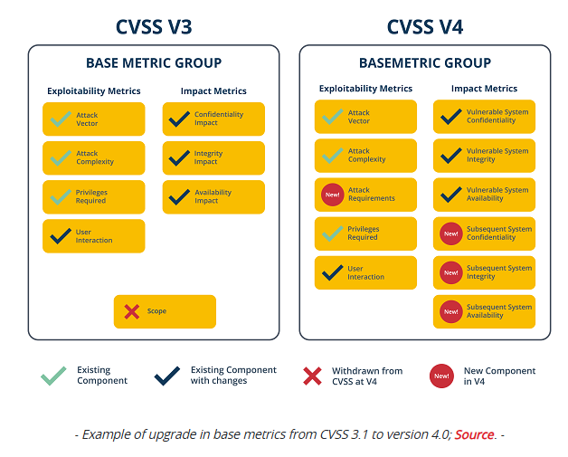 <br>
▲ Fig.CVSSv3tov4

Refer : https://www.incibe.es/en/incibe-cert/blog/cvss-v40-steps-advanced-vulnerability-assessment

我們也可以從 CVE 時間看到 2022 的 CVE 就會是 3.1 的版本 數據上就像是下圖這樣\
這是一個 橢圓曲線簽章演算法 在 Java 上面出現的漏洞\
漏洞編號為 : CVE-2022-21449\
而你能看到 CVSS 3.x 分數為 : 7.5 HIGH

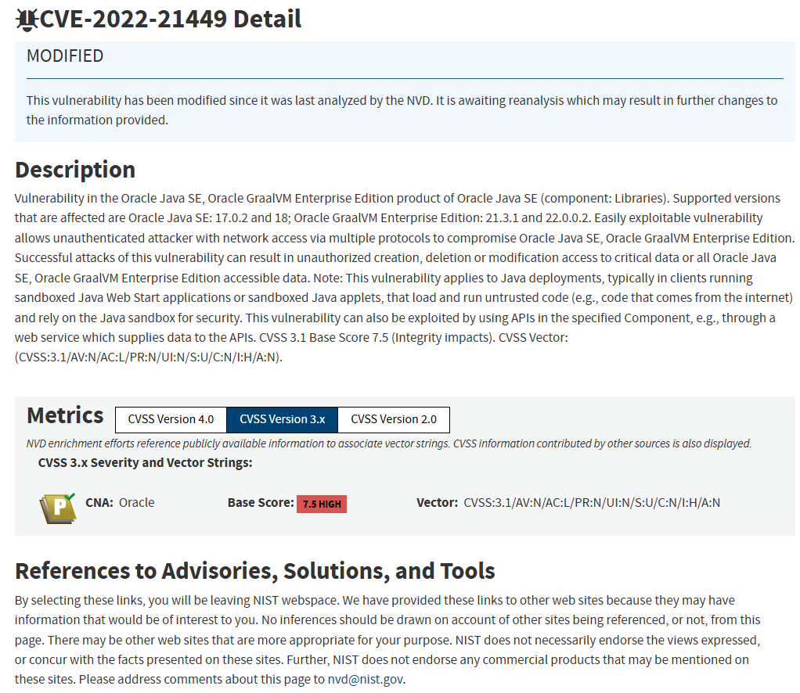 <br>
▲ Fig.CVE-2022-21449

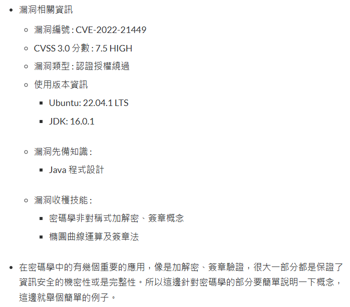 <br>
▲ Fig.Psychic-Signatures-CVE

Refer : https://ithelp.ithome.com.tw/articles/10304518

接下來這個漏洞是 2025 的 CVE 數據上就像是下圖這樣\
是一個 Windows 的預設設定所造成的漏洞，這漏洞允許以更高權限的使用者身分存取命令提示字元
漏洞編號為 : CVE-2025-24479\
而你能看到 CVSS 4.0 分數為 : 8.6 HIGH

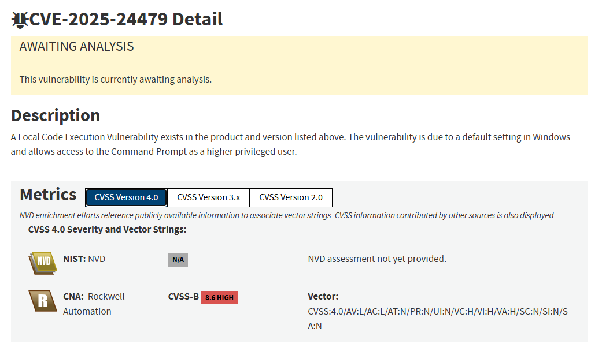 <br>
▲ Fig.CVE-2025-24479.png

Refer : https://nvd.nist.gov/vuln/detail/CVE-2025-24479

且 FIRST 還在 2022年發佈了 TLP 2.0，這是電腦安全事件回應小組（CSIRT）社群在共用敏感資訊時使用的最新版燈號協定（TLP）標準

Refer : https://www.informationsecurity.com.tw/article/article_detail.aspx?aid=10782

---
</br>

## SSDLC vs DevSecOps
> SSDLC = Secure Software Development Life Cycle\
> DevSecOps = Development + Sec + Operations

### 懶人包對照表

| **項目**                | **SSDLC**                                                                                  | **DevSecOps**                                                                                     |
| :--------------------- | :----------------------------------------------------------------------------------------- | :------------------------------------------------------------------------------------------------ |
| **理念**               | 在傳統 SDLC 各階段融入安全檢測<br>採用「階段式流程導向」                                        | 在 DevOps 流程中整合安全<br>強調「文化導向」以自動化、協作、敏捷為核心                              |
| **整合方式**           | 在 SDLC 的需求、設計、開發、測試、部署等<br>每個階段都執行安全檢查，通常由獨立安全階段串接         | 在 CI/CD 流水線中持續插入安全掃描與測試<br>達到快速回饋與自動化                                          |
| **角色責任**           | 多由安全團隊或專門人員主導<br>其它開發與運維團隊較被動                                          | 開發、運維與安全團隊**共同負責**<br>強調「人人有責」的安全文化                                           |
| **開發模式**           | 偏傳統、固定里程碑的專案<br>常配合**瀑布式**或階段分明的開發模式                                | 適用**敏捷**或需要頻繁部署的環境<br>著重**快速疊代**與**持續交付**                                        |
| **回饋速度**           | 多在每個階段結束後才進行安全測試與修正，回饋較慢                                                | 依靠自動化掃描與測試進行即時回饋<br>可迅速修復問題並重新部署                                              |

### Friendly總結
- **SSDLC**：傳統 SDLC 的安全升級版，把安全檢查融入各開發階段
- **DevSecOps**：將安全「Shift Left」並自動化整合到所有 DevOps 流程，每個人都要對安全負責

### DevSecOps Security Control

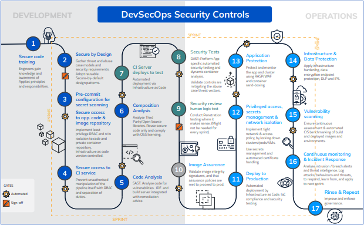 <br>
▲ Fig.DevSecOps_Security_Control

Refer : https://accelera.com.au/what-the-sec-is-devsecops/

---
</br>

## SQL injection 類型
> 各類型已整理成下圖

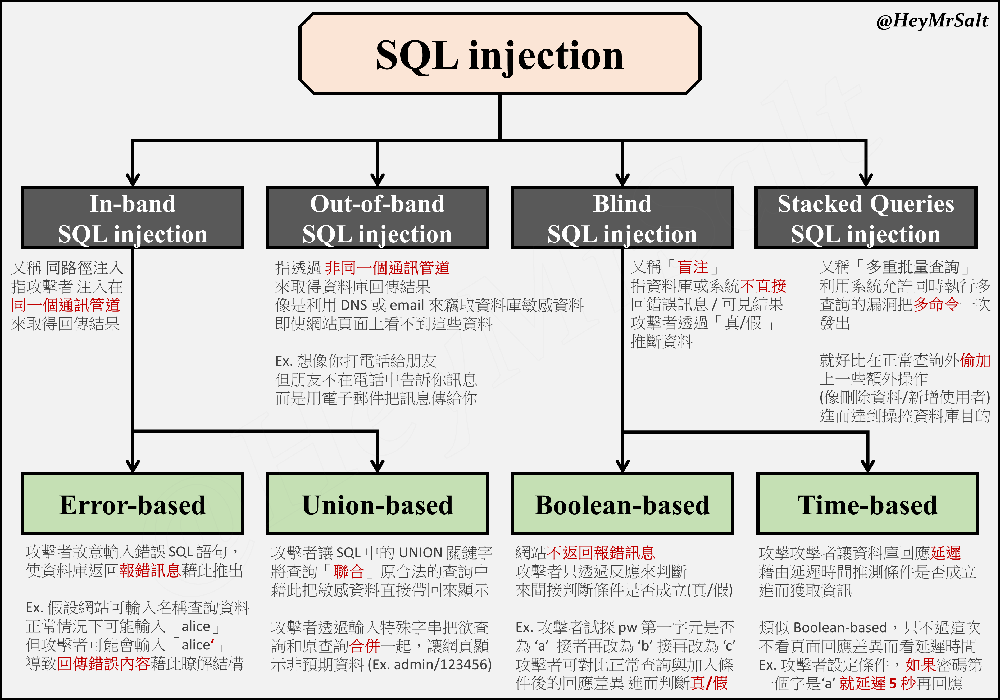 <br>
▲ Fig.SQL_Types

### Quick Review

Q. 請問這是屬於哪種類型
```
' OR 1 = 1 --
```

A: 這個經典的 SQL Injection Payload 是屬於 In-band 的類型<br>
但至於要再細分是 Error-Based 還是 Union-Based 的話

- Error-Based 攻擊者通常會利用回傳的錯誤訊息來推敲資料
- Union-Based 則是藉由 UNION SELECT 來將額外資料拼接到查詢回傳的結果中

而這串 Payload 並沒有去使用錯誤訊息，也沒有使用 UNION SELECT<br>
只是簡單地造成條件永遠為 True 的「Tautology」<br>
因此它不算是 Error-Based，也不是 Union-Based<br>
但屬於 In-band 的沒錯

*Tautology : 在邏輯學中指的是恆真式，也就是無論如何判斷、結果都為「真（True）」的敘述

---
</br>

## 中間人攻擊MITM
> MIMT = Man In The Middle

---
</br>

## 魚叉式網釣
> 先從 Phishing 釣魚網站瞭解起

### 釣魚網站 (Phishing)
是指透過大範圍的誘騙手法\
例如寄送大量看似官方的電子郵件、偽造網站等\
嘗試在廣大群眾中誘騙部分使用者點擊惡意連結、輸入帳號密碼或個人資訊\
特徵是對象眾多、並非特別針對單一對象或組織而設計，內容也較為「大眾化」

### 魚叉式網釣 (Spear Phishing)
指「鎖定特定目標」的精準詐騙手法\
攻擊者會先蒐集目標的背景資訊（例如職稱、所屬部門、工作內容、人際關係）\
再客製化電子郵件或訊息，以提高可信度、提升受害者中招機率\
特徵是高度客製化、針對性強，常出現在重要組織或高價值目標的攻擊情境中\
這種攻擊常見於 APT 或資安威脅中，因為具較高的成功率與滲透深度

所以簡單來說，「釣魚網站」(Phishing) 是以「大量撒網」的方式進行\
而 「魚叉式網釣」(Spear Phishing) 則更精準、更客製化，特別「鎖定」某個人或組織做攻擊

---
</br>

## 0-day零時差漏洞
> 也稱「零日漏洞」

意義：\
也就是在尚未被廠商或防護系統得知、修補或發布修正之前，就已經被攻擊者掌握且可被利用的安全漏洞。

關鍵點：\
因為在廠商不知道或尚未釋出修補程式的情況下，攻擊者可立即利用該漏洞，風險極高。

---
</br>

## Other-days
> 1 N Q 1/2

### 1-day

意義：\
有時稱作「1-day 漏洞」，通常指已被公開或廠商已知曉，甚至已經有修補程式釋出，但攻擊者仍能利用的漏洞。

關鍵點：\
1-day 漏洞通常指的是「已知漏洞」（Known Vulnerability），可能已有修補程式，但尚未被所有用戶或系統管理員及時更新。

### N-day

意義：\
此概念與 1-day 相似，但將「已知漏洞」的時間延長，稱為「N-day 漏洞」。

關鍵點：\
N-day 漏洞代表漏洞已經在公開後持續存在 N 天，攻擊者可能在這段時間內針對尚未更新或修補的系統進行攻擊。

### Q-day

意義：\
此詞較不常見於一般漏洞討論，更多時候是出現在「量子運算」相關的安全議題。\
所謂「Q-day」通常指的是「量子電腦足以破解現行加密技術的那一天」。

關鍵點：\
一旦量子運算能力達到足以破解現行主流加密演算法（如 RSA、ECC 等）的門檻，可能引發大規模的資安危機，故稱之為「Q-day」。

### 0.5-day

意義：\
這並非標準或普遍使用的術語，偶爾在研究或口語場合中有人用「0.5-day」表示「部分公開、部分修補或部分利用」的狀態。

可能的解釋：\
半公開：漏洞資訊已在小範圍（例如特定研究員或封測群）中流傳，但還未完全公開。\
半修補：官方或社群已提出部分臨時解法或繞路修補，但尚未有完整的正式更新。\
半利用：攻擊者掌握部分利用程式，但尚未有完整的自動化攻擊工具。

### Some-days懶人包

- 0-day：廠商未知、無補丁，攻擊者可立即利用。
- 1-day / N-day：漏洞已公開、廠商或社群已知，有可能有修補程式，但尚未完全部署。
- Q-day：量子運算突破加密保護的「那一天」。
- 0.5-day：非標準用語，可能指部分公開、部分修補、或部分利用的中間狀態。

---
</br>

# 用資安新聞學資安名詞

- [【馬偕醫院遭勒索軟體攻擊事件】](#馬偕醫院遭勒索軟體攻擊事件)
- [【Windows使用者介面零時差漏洞】](#Windows使用者介面零時差漏洞)

---
</br>

## 馬偕醫院遭勒索軟體攻擊事件
> Feb 09, 2025
> https://www.ithome.com.tw/news/167327

```
在2025年2月，馬偕紀念醫院遭遇CrazyHunter這支勒索軟體的連續攻擊事件
目前已知攻擊路徑為AD主機並派送惡意程式，攻擊者還利用BVOYD手法規避偵測。我們在此總結了相關資訊

- 這次網路攻擊事件的確是遭CrazyHunter這支勒索軟體攻擊，需注意攻擊者在入侵過程中會從AD管道下手
  透過弱密碼嘗試取得帳號權限，進而透過GPO派送方式發動大範圍勒索加密攻擊。

- H-ISAC的公告內容指出，目前已知攻擊路徑為AD主機並派送惡意程式，惡意程式名稱如下：
  (1)bb.exe，(2)crazyhunter.exe，(3)crazyhunter.sys，(4)zam64.sys，(5)go3.exe，(6)go。

- 奧義智慧發布威脅通報，指出他們近期偵測到Hunter Ransom Group針對醫療機構發動勒索攻擊。
  根據情資顯示，該勒索組織主要攻擊手法包括滲透企業內網並利用SharpGPOAbuse濫用Microsoft AD GPO，進一步在網域（Domain）內部擴散並加密系統檔案。
  此外，攻擊者採用 BYOVD（Bring-Your-Own-Vulnerable-Driver）提權攻擊技術，利用Zemana Driver（原為惡意軟體防護工具ZAM的合法數位簽章驅動程式）。
  然而，此驅動程式已被駭客發現可利用漏洞，進行系統權限提升攻擊（MITRE ATT&CK ID: T1068：Exploitation for Privilege Escalation），
  進而繞過傳統防毒軟體的偵測與防護，最終加密檔案並造成重大損失。
```

- 資安業者Any.Run分析資訊\
[https://any.run/report](https://any.run/report/bdfc66266a2a19fc3d5dccef3eefe4c0ee928ba5b7abad60bc320218b2082fea/c85587f9-3782-4ebd-8204-b0e921374679)

```diff
! 從這個事件我們可以認識幾個專有名詞
```

### AD

什麼是AD？\
企業員工在使用公司電腦開機後，通常會被要求輸入網域、帳號及密碼\
才能存取網路公用資料夾，或是列印文件，並且會受到群組原則的約束\
每3個月必須更換一次密碼，這些機制的背後，其實都與AD網域的帳號認證有關\
*群組原則（Group Policy）

AD（Active Directory）認證是由微軟 Microsoft 提供的目錄服務\
用於在 Windows 網域環境中儲存使用者、和電腦的相關資訊進行認證與集中式管理\
AD 可簡化管理員和終端使用者的工作，同時增強組織的安全性\
管理員可以享受集中化的使用者控制和許可權管理。

一旦攻擊者取得 AD 或 Domain Controller 的高權限（例如 Domain Admin）\
就能掌握整個網域的使用者帳號密碼、群組原則，進而輕易橫向移動或散播惡意程式\
AD 通常是 APT 攻擊者的「終極目標」之一，因為它可以帶來極大的控制權

Refer : https://www.ithome.com.tw/news/151458

</br>

### BYOVD

什麼是BYOVD？
> Bring Your Own Vulnerable Driver)

BYOVD 是指攻擊者帶入「已知存在漏洞或不安全的驅動程式」\
並利用這些已知漏洞來達成提權並達成目的\
例如關閉防毒軟體、安裝 Rootkit\
這類驅動程式往往已經獲得數位簽章，所以在系統層可被視為合法，被安裝或下載不易遭攔截。

Windows 的數位簽章\
是一個確保驅動程式安全性的機制。需要經過簽章驅動才能載入系統。\
新版 Windows 中 在設定 > 隱私權與安全性 > Windows 安全性 > 裝置安全性\
在這當中可看到核心隔離，有一項叫 Microsoft 易受攻擊的驅動程式封鎖清單。\
這按鈕像是防禦開關，就是常被用於 BYOVD 攻擊的驅動程式所做的黑名單，\
只要開啟這項保護，在黑名單的驅動程式就算有簽章也會被擋住而無法載入。

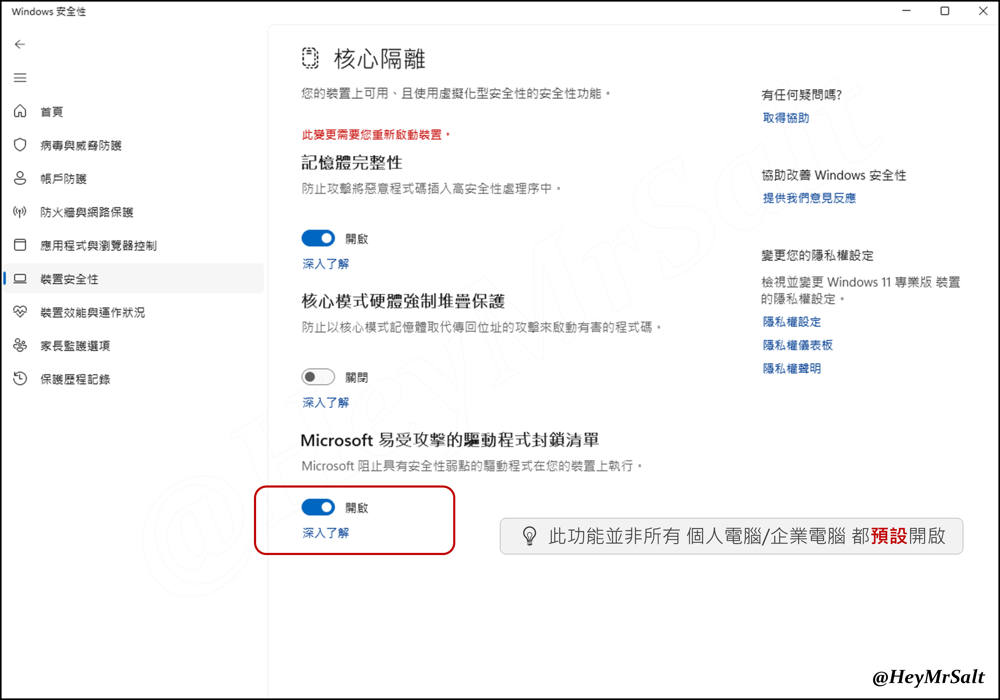 <br>
▲ Fig.Windows_Core_Isolation

通常攻擊者成功提權，即獲取 Kernel 層級，\
即可在核心層級進行操作，可能繞過許多防毒、EDR 等安全防護。\
在最高權限下進一步橫向移動、植入惡意程式或進行其他攻擊行為。

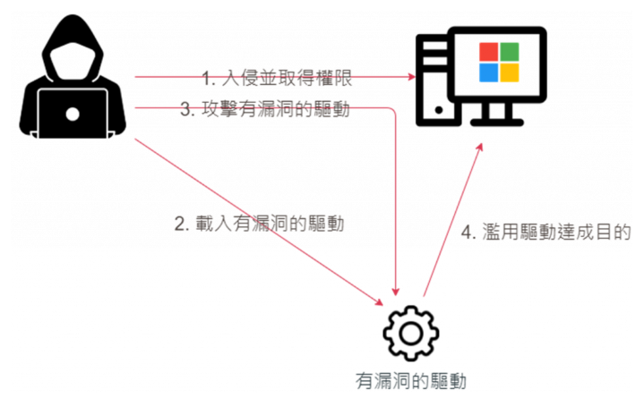 <br>
▲ Fig.BYOVD_Inf_from_Zeze

這圖是來自 大神Zeze 在 iThome 2023 所撰寫的\
**來自核心－烈日的 Windows** 系列文章【第 20 話】BYOVD 攻擊\
好文必須用力推一個，我的這段 BYOVD 筆記也有引用他的闡述\
而 Zeze 這份整個系列文章 從【第 1 話】 Kernel 層概觀\
講到【第 30 話】 WFP 隱藏流量，很精采！推薦大家有興趣一定要去看 

Refer : https://ithelp.ithome.com.tw/articles/10333769

</br>

### Any.Run

什麼是Any.Run？\
**Any.Run** 是一個提供「互動式惡意程式分析」的線上平台\
讓使用者能在受控的虛擬環境中動態觀察及分析惡意程式的行為。

口語的來說就是\
你可以把可疑程式丟進去，然後在安全環境裡直接看它到底做些什麼\
換句話說，它能夠互動式地分析病毒或惡意程式，不用擔心會影響真實系統。\
Any.Run 的畫面大致如下

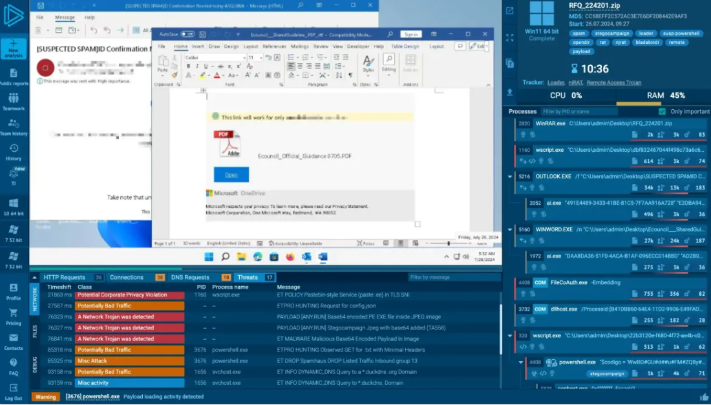 <br>
▲ Fig.ANY_RUN

Refer : https://any.run/

Any.Run 其主要特色包括：

* 互動式分析：使用者可在惡意程式運行期間直接與環境互動，從而更深入地了解程式的行為模式
* 實時監控：平台提供即時數據與事件監控，追蹤惡意程式在執行過程中的網路連線、系統修改、檔案操作等動作
* 詳細報告：在分析結束後，系統會生成包含系統活動、進程、網路流量等詳細資訊的報告，方便後續的安全研究與取證工作
* 雲端運算平台：由於基於雲端運算，使用者無需自行建置虛擬機器環境，就能輕鬆進行惡意程式分析，節省資源與時間

這些特色使得 Any.Run 成為安全研究人員、資安分析師及事件回應團隊在研究及應對惡意程式時的重要工具

</br>

---
</br>

## Windows使用者介面零時差漏洞
> Feb 14, 2025
> https://www.ithome.com.tw/news/167383

以下來自 iThome新聞
> https://www.ithome.com.tw/news/167379

```
2025年2月，駭客 Mustang Panda 積極利用此漏洞，進一步掩蓋攻擊痕跡。
由威脅情報業者 ClearSky Cyber Security 於 02 月 13 日發現並提出警告

- ClearSky Cyber Security 發現 Windows 作業系統 GUI 存在零時差漏洞（尚未登記 CVE 編號）
  雖然通報後微軟評估為低風險弱點，但已出現遭駭客積極利用的情況

- 這項弱點涉及檔案總管處理RAR壓縮檔的過程，由於微軟在2023年10月開始對Windows 11 22H2加入相關功能
  這代表曝險範圍可能是執行Windows 11及Windows Server 2025的工作站電腦及伺服器

- 駭客利用 RAR檔內含隱藏屬性檔案，利用命令列解壓到隱藏資料夾，使該資料夾在檔案總管與命令提示字元中均看不見
  就連使用者透過命令提示字元下達 dir 指令，也不會出現
```

</br>

以下來自 ClearSky Cyber Security 在 X 上的發布
> https://x.com/ClearskySec/status/1890056915230544224

```
ClearSky Cyber Security has discovered a UI vulnerability in Microsoft Windows.
This vulnerability is actively exploited by a suspected Chinese APT group - Mustang Panda.

When files are extracted from compressed “RAR” files they are hidden from the user.
If the compressed files are extracted into a folder, the folder appears empty in the Windows Explorer GUI.

When using the "dir" command to list all files and folders inside the target folder,
the extracted files and folders are "invisible/hidden" to the user.

Threat actors or users can also execute those compressed files from a command line prompt,
if they know the exact path. As a result of executing "attrib -s -h" to  system protected files,
an unknown file type is created from the type "Unknown" ActiveX component.

More details will be published in our blog.
Microsoft classified it as a low-severity vulnerability.

MD5: 3bd2eeda66ec057727be8810fee5da38
```

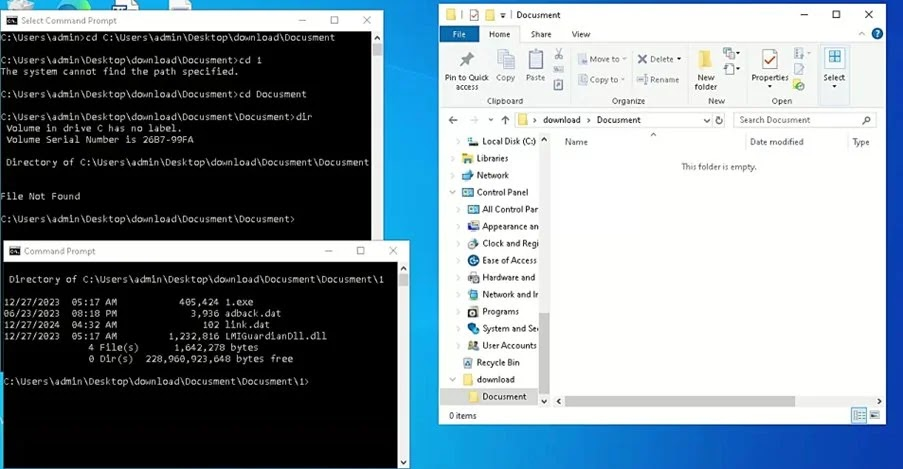 <br>
▲ Fig.ClearSky_Windows_UI_0day

```diff
! 從這個事件我們可以認識幾個專有名詞
```

### APT Group
APT Group (進階持續性威脅團隊)\
我想直接來看 下方連結 就可以理解了 只不過他們是個組織團隊\
[【APT 名詞說明 以及 常用技術手法】](#APT-名詞說明-以及-常用技術手法)

### dir Command
是一個在 Windows 命令提示字元中使用的指令，用來列出指定目錄下所有檔案與資料夾\
但由於漏洞，利用此指令也看不到那些隱藏的檔案

### ActiveX Component
是微軟的一個軟體元件架構，允許不同的應用程式在 Windows 平台上互相溝通與執行特定功能\
文章中提到因指令操作而產生的「Unknown ActiveX 元件」代表了異常行為

### MD5
MD5 是一種加密雜湊演算法，可用於生成檔案的唯一摘要值（雜湊值），常用來驗證檔案完整性\
文章中提供的 MD5 值可用來辨識或比對檔案內容\
不過要知道 現在嚴格來說 MD5 早已經不安全了\
被證實是可以被破解了，存在**碰撞漏洞**\
主要就是因為攻擊者能夠利用其碰撞弱點，找到兩個不同的輸入資料卻得到相同的雜湊\
這代表著 MD5 的設計中存在缺陷，不再適合作為安全的加密雜湊演算法，尤其在需要防範惡意攻擊的情境下

Refer : https://hoploninfosec.com/windows-ui-vulnerability-exploited/

---
</br>

---
---
---

</br>

# Refer

> 參考來源與致敬

1. [iPas-詳解表-1120805](https://docs.google.com/spreadsheets/d/1Nj3shzjCJZBqBOhLjRVV2iIYokPLWThtbadLJT9izfE/edit?gid=0#gid=0) 
2. [iPAS資安證照討論區 Q&A - @hiiii](https://hackmd.io/@hiiii/ryOzgaf0a)
3. [iPAS資訊安全工程師中級筆記 - @dkri3c1](https://hackmd.io/@dkri3c1/r1jWTXCtA)
4. [iPAS資訊安全工程師中級筆記 - @Not](https://hackmd.io/@Not/iPASInformationSecuritySpecialist)
5. [iPAS資訊安全工程師-中級-12天準備歷程記錄&考古題資源提供 - @Bad Mind](https://hackmd.io/@7ZcmfE2ETz-ntel2Ma6uTg/ByhWE-qs2)
6. [iPAS 資安法規及標準筆記 - @ywc](https://hackmd.io/@ywChen/H192F7VPC/https%3A%2F%2Fhackmd.io%2F%40ywChen%2FS1wHQ5EcC)
7. [CISSP 資安獨孤九劍 - @hpsh31323](https://hackmd.io/@hpsh31323/rk3mgXD7p#CISSP-%E8%B3%87%E5%AE%89%E7%8D%A8%E5%AD%A4%E4%B9%9D%E5%8A%8D)
8. [iThome](https://www.ithome.com.tw/) 

---
</br>

# 筆記結束按我回到目錄
[【Go Top】](#目錄)

---
</br>

###### tags: `資安證照` `iPAS中級資安工程師` 

This work is licensed under a </br>
[Creative Commons Attribution-NonCommercial-NoDerivs 4.0 International License][cc-by-nc-nd].

[![CC BY-NC-ND 4.0][cc-by-nc-nd-shield]][cc-by-nc-nd] 　 [![CC BY-NC-ND 4.0][cc-by-nc-nd-image]][cc-by-nc-nd] 

[cc-by-nc-nd]: http://creativecommons.org/licenses/by-nc-nd/4.0/
[cc-by-nc-nd-image]: https://licensebuttons.net/l/by-nc-nd/4.0/88x31.png
[cc-by-nc-nd-shield]: https://img.shields.io/badge/License-CC%20BY--NC--ND%204.0-lightgrey.svg
